# แปลเกมเป็นภาษาไทยแบบเรียลไทม์ด้วยโปรแกรม PCOT: การตั้งค่าโปรแกรม
ปรับปรุงล่าสุด: 14 ส.ค. 2566

 - [การตั้งค่าโปรแกรม](#การตั้งค่าโปรแกรม)
   - [การตั้งค่าโปรแกรม MPC-BE](#การตั้งค่าโปรแกรม-mpc-be)
   - [การตั้งค่าโปรแกรม PCOT](#การตั้งค่าโปรแกรม-pcot)
     - [การตั้งค่าเริ่มต้น](#การตั้งค่าเริ่มต้น)
     - [การเพิ่มภาษาสำหรับ Tesseract OCR](#การเพิ่มภาษาสำหรับ-tesseract-ocr)

## การตั้งค่าโปรแกรม

ในการใช้งานโปรแกรมครั้งแรก เราต้องตั้งค่าต่าง ๆ ให้พร้อมใช้แปลภาษาจากเกมส์ ดังนี้

### การตั้งค่าโปรแกรม MPC-BE

 - รันไฟล์ **"C:\Translator\MPC-BE.1.6.8.5.x64\mpc-be64.exe"** แล้วกดที่ **"<ins>More info</ins>"**

   <kbd>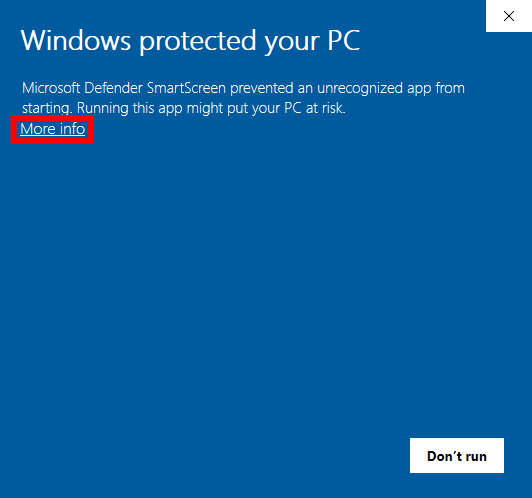</kbd>
 - กดปุ่ม **"Run anyway"**

   <kbd></kbd>
 - ไปที่เมนู **"View"** → **"Option..."**

   <kbd>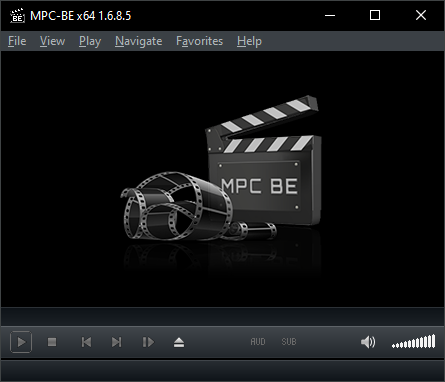</kbd>
 - ทางด้านซ้าย ให้เลือก **"Player"** → หัวข้อ **"Location of settings"** ให้เลือกรายการ **"Player folder"**

   <kbd></kbd>
  - ทางด้านซ้าย ให้เลือก **"Mouse"** → หัวข้อ **"Left button"** ให้เลือกรายการ **""** ว่าง ๆ ดังรูป

    <kbd>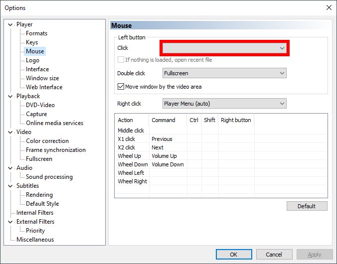</kbd>
 - ทางด้านซ้าย ให้เลือก **"Capture"** → รายการ **"Video"** ให้เลือกชื่อ HDMI capture card ที่รับสัญญาณ HDMI มาจากเครื่องเล่นเกมส์ หากต้องการฟังเสียงจากเครื่องเล่นเกมส์ด้วย ให้เลือก รายการ **"Audio"** เพิ่มเติม แต่หากฟังเสียงโดยเสียบหูฟังที่เครื่องโดยตรงก็ไม่ต้องเปลี่ยนหัวข้อนี้

   <kbd>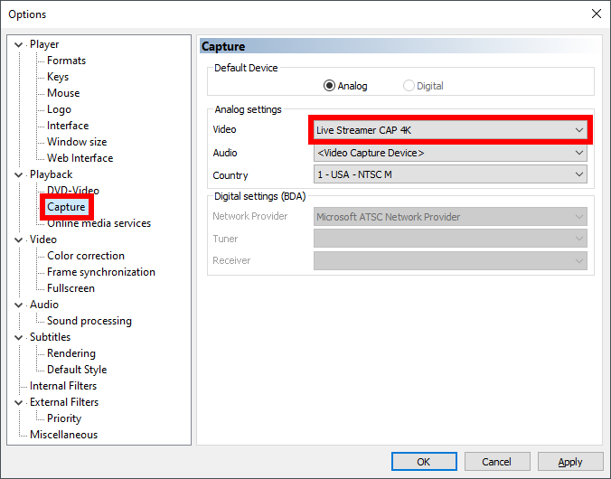</kbd>
 - กดปุ่ม **"OK"** ทางด้านล่าง

   <kbd></kbd>
 - เสร็จสิ้นการตั้งค่าโปรแกรม MPC-BE

### การตั้งค่าโปรแกรม PCOT

#### การตั้งค่าเริ่มต้น

 - รันไฟล์ **"C:\Translator\PCOT\PCOT.exe"** แล้วกดที่ **"<ins>More info</ins>"**

   <kbd></kbd>
 - กดปุ่ม **"Run anyway"**

   <kbd></kbd>
 - โปรแกรมจะแสดงหน้าจอโพรเซส (Process) ที่เราต้องการแปลภาษา ในที่นี้เราจะเลือกรายการที่ **"タイトル (Title)"** ชื่อว่า **"MPC-BE x64 1.6.8.5"** หรือดูจากรายการที่ **"プロセス名 (Process name)"** ชื่อว่า **"mpc-be64"** ก็ได้เช่นกัน จากนั้นให้กดปุ่ม **"選択 (Selection)"** ทางด้านล่าง

   <kbd></kbd>
 - ที่มุมล่างซ้ายของโปรแกรมจะแสดงชื่อโพรเซสที่ทำการเชื่อต่ออยู่ **"接続中 (Connecting)"**

   <kbd></kbd>
 - ไปที่เมนู **"設定 (Setting)"** → **"システム設定 (System setting)"**

   <kbd>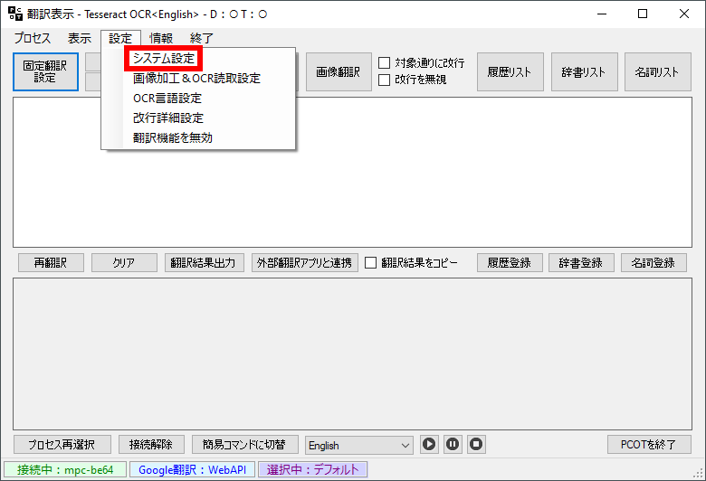</kbd>
 - ที่หน้าต่าง **"PCOTシステム設定  (PCOT system settings)"** เราจะทำการเปลี่ยนฟอนต์ในหัวข้อ **"フォント設定 (Font settings)"** เพื่อให้อ่านข้อความได้ง่ายขึ้น
   - กดที่ปุ่ม **"原文フォント設定 (Source font setting)"** เพื่อเปลี่ยนฟอนต์ภาษาต้นฉบับ
     
     <kbd></kbd>
     
     <kbd></kbd>
   - กดที่ปุ่ม **"訳文フォント設定 (Translation font setting)"** เพื่อเปลี่ยนฟอนต์ภาษาที่ต้องการคำแปล

     <kbd></kbd>

     <kbd></kbd>
 - เมื่อเปลี่ยนฟอนต์เสร็จแล้ว ให้ติ๊กถูกที่ **"終了時に画面の座標とサイズを記憶 (Remember screen coordinates and size on exit)"** เพื่อให้ PCOT จำตำแหน่งและขนาดหน้าจอเมื่อปิดโปรแกรม

   <kbd>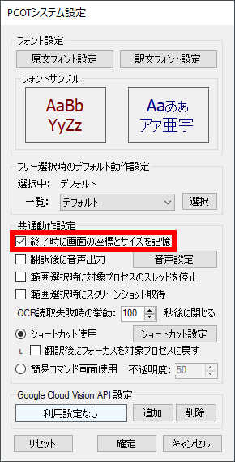</kbd>
 - ติ๊กถูกที่ **"範囲選択時に対象プロセスのスレッドを停止 (Stop the thread of the target process when selecting a range)"** เพื่อหยุดภาพบนหน้าจอของเกมระหว่างการใช้เมาส์ลากคลุมพื้นที่ ช่วยให้แปลงข้อความได้เร็วขึ้น โดยเฉพาะเกมที่ฉากหลังขยับไปมาด้วยความรวดเร็ว

   <kbd>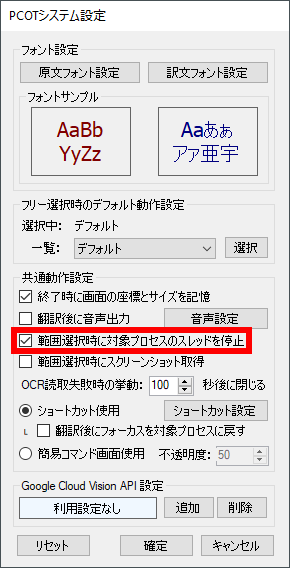</kbd>
 - ที่รายการ **"OCR読取失敗時の挙動： ... 秒後に閉じる (OCR read failure behavior: Close after ... seconds)"** ให้เปลี่ยนเป็นเลข 1 เพื่อให้ PCOT ปิดหน้าจอการอ่าน OCR หากตรวจไม่พบตัวอักษรบนหน้าจอ หลังจากผ่านไป 1 วินาที

   <kbd>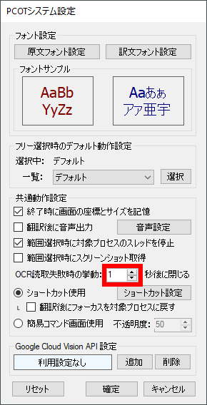</kbd>
 - จากนั้นให้
   - กดปุ่ม **"確定 (Confirm)"** เพื่อยืนยันการตั้งค่า
   - หรือกดปุ่ม **"キャンセル (Cancel)"** ขวาสุด เพื่อยกเลิกการตั้งค่า
   - หรือกดปุ่ม **"リセット (Reset)"** ซ้ายสุด เพื่อรีเซ็ตเป็นค่าเริ่มต้น

     <kbd></kbd>

#### การเพิ่มภาษาสำหรับ Tesseract OCR

ในการแปลภาษาจากเกมส์ต่าง ๆ จำเป็นต้อง download [ไฟล์ภาษาของ Tesseract OCR](https://tesseract-ocr.github.io/tessdoc/Data-Files.html) เพื่อให้โปรแกรม PCOT สามารถอ่านข้อความในเกมส์แล้วแปลงออกมาเป็นตัวอักษร (OCR) เพื่อใช้แปลภาษา (Translate) ต่อไป ขั้นตอนการติดตั้งภาษาต่าง ๆ มีดังนี้

 - ไปที่เมนู **"設定 (Setting)"** → **"OCR言語設定 (OCR language setting)"**

   <kbd></kbd>
 - ที่หน้าต่าง **"Tesseract OCR言語設定 (Tesseract OCR Language Settings)"** จะแสดงรายการภาษาต้นฉบับต่าง ๆ ที่ PCOT รองรับ **"対応言語一覧：(List of supported languages：)"** รายการภาษาต้นฉบับที่มีเครื่องหมาย **"\* (ดอกจัน)"** นำหน้าชื่อภาษา แสดงว่าเราได้ download ภาษาต้นฉบับนั้นและ PCOT พร้อมใช้งาน OCR แล้ว โดย PCOT ที่เราได้ download ตอนต้นจะมาพร้อมกับภาษาอังกฤษและไม่สามารถลบภาษานี้ออกจาก PCOT ได้ โดยในกรอบสี่เหลี่ยมด้านล่างจะแสดงข้อความว่า **"利用可能(削除不可) (Available (cannot be deleted))"** และปุ่ม **"削除 (Delete)"** จะไม่สามารถกดได้

   <kbd>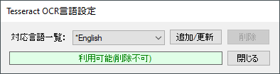</kbd>
 - ในตอนนี้เราจะทดลอง download ภาษาต้นฉบับญี่ปุ่นเพิ่มเติม ในรายการ **"対応言語一覧：(List of supported languages：)"** ให้เลือก **"Japanese"** โดยในกรอบสี่เหลี่ยมด้านล่างจะแสดงข้อความว่า **"Tesseract OCRの言語データがありません (Missing language data for Tesseract OCR)"**

   <kbd>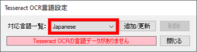</kbd>
 - กดปุ่ม **"追加/更新 (Add/Update)"** เพื่อ download ภาษาต้นฉบับญี่ปุ่น

   <kbd></kbd>
 - รอให้ PCOT download ภาษาต้นฉบับสักครู่

   <kbd>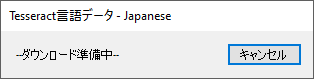</kbd>

   <kbd>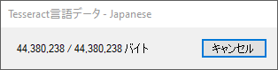</kbd>
 - เมื่อ download เสร็จแล้ว ให้กดปุ่ม **"OK"** เป็นอันเสร็จสิ้นการเพิ่มภาษาต้นฉบับของ Tesseract OCR

   <kbd>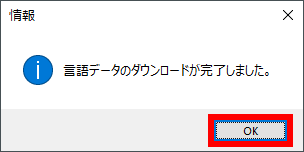</kbd>
 - ให้ทำการเพิ่มภาษาต้นฉบับต่าง ๆ ที่ต้องการให้ครบถ้วนตามขั้นตอนข้างต้น
 - กดปุ่ม **"閉じる (Close)"** เพื่อปิดหน้าต่าง **"Tesseract OCR言語設定 (Tesseract OCR Language Settings)"**

   <kbd></kbd>
