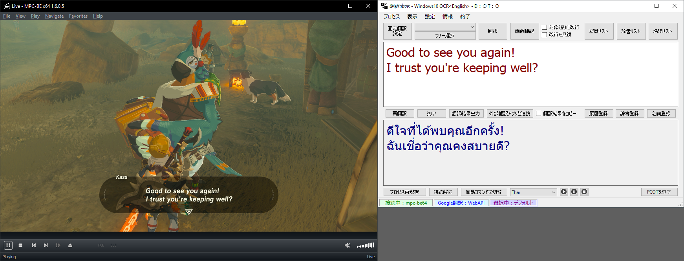
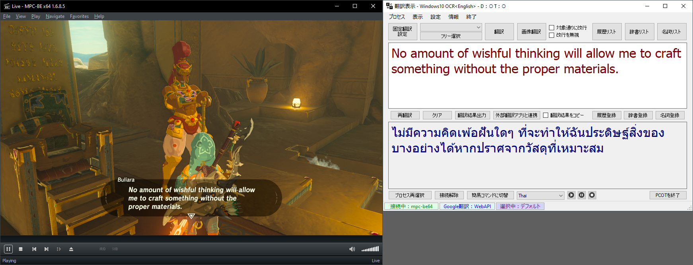

# แปลเกมเป็นภาษาไทยแบบเรียลไทม์ด้วยโปรแกรม PCOT
ปรับปรุงล่าสุด: 14 ส.ค. 2566

 - [แนะนำโปรแกรม](#แนะนำโปรแกรม)
   - [เปรียบเทียบ Google Lens กับ PCOT](#เปรียบเทียบ-google-lens-กับ-pcot)
 - [การติดตั้งโปรแกรม](#การติดตั้งโปรแกรม)
   - [การติดตั้งโปรแกรม PCOT](#การติดตั้งโปรแกรม-pcot)
   - [การติดตั้งโปรแกรม Microsoft Visual C++ 2015-2022 Runtime Libraries](#การติดตั้งโปรแกรม-microsoft-visual-c-2015-2022-runtime-libraries)
   - [การติดตั้งโปรแกรม MPC-BE Portable](#การติดตั้งโปรแกรม-mpc-be-portable)
 - [การตั้งค่าโปรแกรม](#การตั้งค่าโปรแกรม)
   - [การตั้งค่าโปรแกรม MPC-BE](#การตั้งค่าโปรแกรม-mpc-be)
   - [การตั้งค่าโปรแกรม PCOT](#การตั้งค่าโปรแกรม-pcot)
     - [การตั้งค่าเริ่มต้น](#การตั้งค่าเริ่มต้น)
     - [การเพิ่มภาษาสำหรับ Tesseract OCR](#การเพิ่มภาษาสำหรับ-tesseract-ocr)
 - [การใช้งาน MPC-BE](#การใช้งาน-mpc-be)
 - [การใช้งาน PCOT](#การใช้งาน-pcot)
   - [การแปลภาษาแบบ Free Selection](#การแปลภาษาแบบ-free-selection)
   - [การแปลภาษาแบบ Fixed Translation](#การแปลภาษาแบบ-fixed-translation)
     - [การสร้างรายการ Fixed Translation](#การสร้างรายการ-fixed-translation)
     - [การแก้ไขรายการ Fixed Translation](#การแก้ไขรายการ-fixed-translation)
     - [การลบรายการ Fixed Translation](#การลบรายการ-fixed-translation)
   - [Windows 10 OCR Engine](#windows-10-ocr-engine)
     - [การเพิ่มภาษาสำหรับ Windows 10 OCR](#การเพิ่มภาษาสำหรับ-windows-10-ocr)
   - [การตั้งค่าการอ่าน OCR](#การตั้งค่าการอ่าน-ocr)
   - [Image Processing](#image-processing)
 - [PCOT Tips](#pcot-tips)
   - [การสร้างโพรเซสนามแฝง เพื่อให้ Fixed Translation เปลี่ยนไปตามเกมต่าง ๆ](#การสร้างโพรเซสนามแฝง-เพื่อให้-fixed-translation-เปลี่ยนไปตามเกมต่าง-ๆ)
   - [เทคนิคเพิ่มความแม่นยำในการแปลให้ดีขึ้น](#เทคนิคเพิ่มความแม่นยำในการแปลให้ดีขึ้น)
   - [PCOT Simple Mode](#pcot-simple-mode)
 - [ข้อมูลอ้างอิง](#ข้อมูลอ้างอิง)

## แนะนำโปรแกรม

<kbd></kbd>

<kbd></kbd>

<kbd></kbd>

โปรแกรม [PCOT](http://www.gc-net.jp/s_54/) ย่อมาจาก <ins>P</ins>rocess <ins>C</ins>onnect <ins>O</ins>CR <ins>T</ins>ranslator เป็น translation support tools โดยคุณ Nuruppo ที่ใช้เทคโนโลยี[การรู้จำอักขระด้วยแสง (OCR)](https://th.wikipedia.org/wiki/การรู้จำอักขระด้วยแสง) รวมเข้ากับ[การแปลด้วยเครื่อง (machine translation)](https://th.wikipedia.org/wiki/การแปลด้วยเครื่อง) โดยใช้บริการแปลภาษาจาก Google Translate และ [Microsoft DeepL Translate](https://www.deepl.com/en/windows-app/) ทำให้การแปลภาษาจากรูปภาพเป็นเรื่องที่ง่ายเพียงแค่คลิกเดียวเท่านั้น

เดิมที PCOT ถูกพัฒนามาเพื่อแปลภาษาในเกมส์บน Windows เป็นหลัก แต่ตัวผมเองนำมาประยุกต์ให้ใช้แปลเกมส์จากเครื่อง [Nintendo Switch](https://www.nintendo.com/th/switch/index.html) (หรือเครื่องเล่นเกมส์อื่น ๆ) ผ่านการใช้งาน HDMI capture card โดยแสดงหน้าจอเกมส์ด้วยโปรแกรม [MPC-BE](https://www.videohelp.com/software/MPC-BE)

เหตุผลที่เลือก PCOT + MPC-BE เพื่อใช้แปลภาษาจากเกมส์เนื่องจาก
 - โปรแกรมมีขนาดเล็ก ทั้งสองโปรแกรมรวมกันไม่ถึง 40 MB และไม่จำเป็นต้องติดตั้งโปรแกรม เพียงแค่แตกไฟล์ก็พร้อมใช้งานได้ทันที
   - ขนาดไฟล์ที่ download
     - **PCOT v1.6.0:** 26,522,036 bytes
     - **MPC-BE v1.6.8.5 (x64):** 13,380,429 bytes
 - PCOT สามารถตั้งค่า image processing ได้ ช่วยให้แปลภาษาแม่นยำมากขึ้น
 - ฟรี ไม่มีค่าใช้จ่าย

ส่วนข้อเสียของ PCOT ก็อาจจะเป็นโปรแกรมที่คุณ Nuruppo พัฒนามาเพื่อใช้งานส่วนตัวเป็นหลัก (อ้างอิงจากบทสัมภาษณ์จาก [GameSpark](https://www.gamespark.jp/article/2021/07/02/110097.html)) ทำให้หน้าจอโปรแกรมมีแค่ภาษาญี่ปุ่นเท่านั้น, ไม่มีคู่มือสอนการใช้งาน (แต่ก็มีคนญี่ปุ่นหลาย ๆ ท่านทำคลิปสอบพร้อมคำบรรยายภาษาอังกฤษ เช่น [Yamachannel](https://www.youtube.com/watch?v=hvPRcvR8bCo) เป็นต้น) ซึ่งบทความนี้ก็จะแนะนำการติดตั้งและใช้งาน PCOT เบื้องต้นให้เป็นขั้นตอนที่สามารถทำตามได้ด้วยตนเอง แต่จะไม่ได้รวมถึงถึงการแปลด้วย DeepL เนื่องจาก DeepL ยังไม่ได้รองรับการแปลเป็นภาษาไทย หากอนาคตรองรับผมจะกลับมาอัพเดทเพิ่มเติมให้ครับ

### เปรียบเทียบ Google Lens กับ PCOT

ถึงแม้ Google Lens และ PCOT จะสามารถแปลภาษาได้ด้วยกันทั้งคู่ แต่วิธีการใช้งาน การปรับแต่งค่าต่าง ๆ ค่อนข้างแตกต่างกัน ผมขอสรุปความแตกต่างในส่วนที่เราใช้แปลเกมส์เป็นภาษาไทยแบบเรียลไทม์ไว้ดังนี้ครับ

|Google Lens|PCOT|
|-|-|
|ใช้งานผ่านโปรแกรมบนมือถือโดยโฟกัสไปที่ภาษาต้นฉบับพื่อแปลภาษา|ใช้งานผ่านโปรแกรมบนเครื่องคอมพิวเตอร์โดยระบุพื้นที่หน้าจอเพื่อแปลภาษา|
|แสดงภาษาที่ต้องการคำแปลแทนที่ภาษาต้นฉบับ|แสดงภาษาที่ต้องการคำแปลในโปรแกรม PCOT|
|ไม่สามารถกำหนดพื้นที่ที่ต้องการแปลภาษาไว้ล่วงหน้าได้|สามารถกำหนดพื้นที่หน้าจอที่ต้องการแปลภาษาไว้ล่วงหน้าได้ เพิ่มความสะดวกในการแปลภาษา|
|ตั้งค่า image processing ไม่ได้|ตั้งค่า image processing ได้ ช่วยให้แปลภาษาแม่นยำมากขึ้น|
|เลือกใช้ OCR engine ไม่ได้|เลือกใช้ [Tesseract OCR](https://github.com/tesseract-ocr/tesseract) หรือ Windows 10 OCR ได้|
|ใช้บริการจาก Google Translate เท่านั้น|เลือกใช้บริการจาก Google Translate และ Microsoft DeepL Translate ได้พร้อมกัน|
