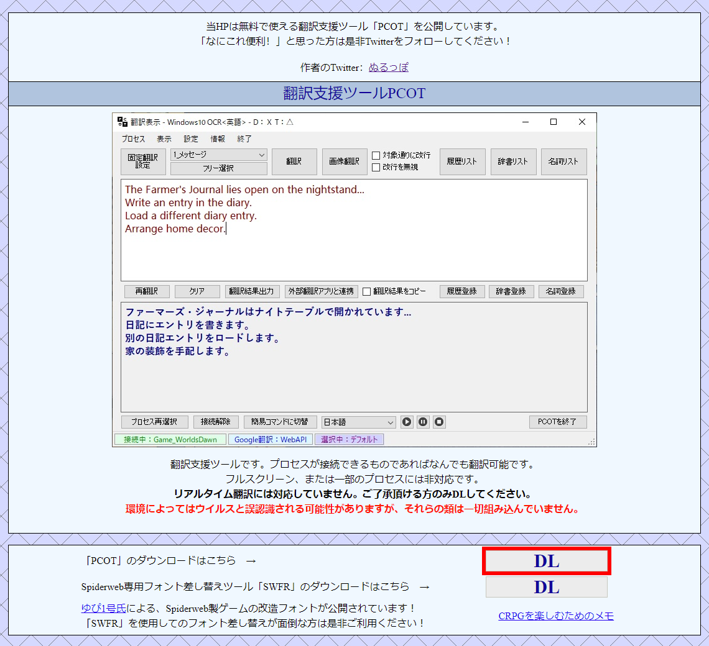
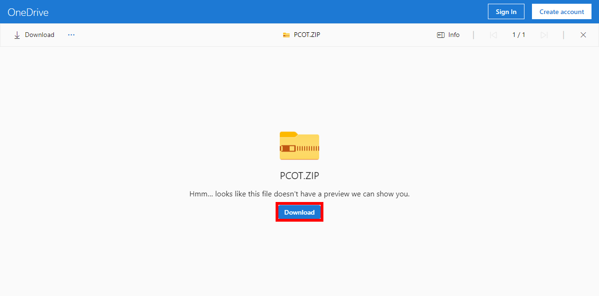

# PCOT (Process Connect OCR Translator)
วิธีการใช้งานโปรแกรมแปลภาษา PCOT

 - [แนะนำโปรแกรม](#แนะนำโปรแกรม)
   - [Google Lens vs PCOT](#google-lens-vs-pcot)
 - [การติดตั้งโปรแกรม](#การติดตั้งโปรแกรม)
   - [การติดตั้งโปรแกรม PCOT](#การติดตั้งโปรแกรม-pcot)
   - [การติดตั้งโปรแกรม Microsoft Visual C++ 2015-2022 Redistributable](#การติดตั้งโปรแกรม-microsoft-visual-c-2015-2022-redistributable)
   - [การติดตั้งโปรแกรม MPC-BE Portable](#การติดตั้งโปรแกรม-mpc-be-portable)
 - [การตั้งค่าโปรแกรม](#การตั้งค่าโปรแกรม)
   - [การตั้งค่าโปรแกรม PCOT](#การตั้งค่าโปรแกรม-pcot)
     - [การตั้งค่าเริ่มต้น](#การตั้งค่าเริ่มต้น)
     - [การเพิ่มภาษา](#การเพิ่มภาษา)
   - [การตั้งค่าโปรแกรม MPC-BE](#การตั้งค่าโปรแกรม-mpc-be)
 - [การใช้งาน PCOT](#การใช้งาน-pcot)
   - [การเลือกภาษา](#การเลือกภาษา)
   - [รูปแบบการแปลภาษา](#รูปแบบการแปลภาษา)
     - [Free Selection](#free-selection)
     - [Fixed Selection](#fixed-selection)
   - [Windows 10 OCR](#windows-10-ocr)
   - [Image Processing](#image-processing)
 - [ข้อมูลอ้างอิง](#ข้อมูลอ้างอิง)

## แนะนำโปรแกรม

[PCOT](http://www.gc-net.jp/s_54/) เป็น translation support tools โดยคุณ Nuruppo ใช้เทคโนโลยี[การรู้จำอักขระด้วยแสง (OCR)](https://th.wikipedia.org/wiki/การรู้จำอักขระด้วยแสง) บวกเข้ากับ[การแปลด้วยเครื่อง (machine translation)](https://th.wikipedia.org/wiki/การแปลด้วยเครื่อง) รองรับ Google Translate และ Microsoft DeepL Translate

### Google Lens vs PCOT

|Google Lens|PCOT|
|-|-|
|แสดงข้อความที่แปลบนข้อความต้นฉบับ|แสดงข้อความที่แปลในโปรแกรม PCOT|
|ใช้งานผ่านกล้องบนมือถือ|ใช้งานผ่านโปรแกรมบนเครื่องคอมพิวเตอร์|
|ใช้การถือมือถือโฟกัสบนข้อความที่หน้าจอเพื่อแปลภาษา|ใช้การกำหนด region ที่ต้องการบนหน้าจอเพื่อการแปลภาษา|
|ตั้งค่า image processing ไม่ได้|ตั้งค่า image processing ได้ เพื่อแปลภาษาที่แม่นยำขึ้น|
|เลือกใช้ OCR engine ไม่ได้|เลือกใช้ [Tesseract OCR](https://github.com/tesseract-ocr/tesseract) หรือ Windows 10 OCR ได้|
|ใช้บริการ Google Translate เท่านั้น|เลือกใช้บริการ Google Translate และ [Microsoft DeepL](https://www.deepl.com/en/windows-app/) ได้พร้อมกัน|

## การติดตั้งโปรแกรม

### การติดตั้งโปรแกรม PCOT

 - เปิดไปที่เวป [PCOT](http://www.gc-net.jp/s_54/)
 - กดปุ่ม **「DL」**
   
   
 - กดปุ่ม **「Download」**
   
   

### การติดตั้งโปรแกรม Microsoft Visual C++ 2015-2022 Redistributable

Microsoft Visual C++ 2015-2022 Redistributable v14.36.32532
 - x64: [https://aka.ms/vs/17/release/vc_redist.x64.exe](https://aka.ms/vs/17/release/vc_redist.x64.exe)
 - x86: [https://aka.ms/vs/17/release/vc_redist.x86.exe](https://aka.ms/vs/17/release/vc_redist.x86.exe)

 - รันไฟล์ Microsoft Visual C++ 2015-2022 Redistributable ติ๊กถูกที่ 「I agree to the license terms and conditions」 แล้วกดปุ่ม 「Install」
   
   
 - รอจนโปรแกรมติดตั้งเสร็จ แล้วกดปุ่ม 「Close」
   
   

ข้อมูลเพิ่มเติม: [Microsoft Visual C++ Redistributable latest supported downloads](https://learn.microsoft.com/en-us/cpp/windows/latest-supported-vc-redist?view=msvc-170)

### การติดตั้งโปรแกรม MPC-BE Portable

MPC-BE
 - x64: [MPC-BE.1.6.8.5.x64](https://www.videohelp.com/download/MPC-BE.1.6.8.5.x64.7z)
 - x86: [MPC-BE.1.6.8.5.x86](https://www.videohelp.com/download/MPC-BE.1.6.8.5.x86.7z)

ที่มา: [MPC-BE](https://www.videohelp.com/software/MPC-BE)

## การตั้งค่าโปรแกรม

### การตั้งค่าโปรแกรม PCOT

#### การตั้งค่าเริ่มต้น

#### การเพิ่มภาษา

### การตั้งค่าโปรแกรม MPC-BE

## การใช้งาน PCOT

### การเลือกภาษา

### รูปแบบการแปลภาษา

#### Free Selection

#### Fixed Selection

### Windows 10 OCR

### Image Processing

## ข้อมูลอ้างอิง
 - [Guide :: Recommended Screen Translation Software](https://steamcommunity.com/sharedfiles/filedetails/?id=2847675160)
 - [画面翻訳で簡単に日本語化可能！「PCOT」の使い方ガイド](https://steamcommunity.com/sharedfiles/filedetails/?id=2649183272)
 - [PCOTで日本未対応のゲームを簡単翻訳！便利な機能と使い方を紹介](https://yamachannel-blog.com/game-translation/)
 - [PCOTで日本語未対応のゲームを簡単翻訳！導入方法と基本的な使い方を紹介](https://yamachannel-blog.com/game-translation-pcot/)
 - [An Experimental Performance Analysis on Robotics Process Automation (RPA) With Open Source OCR Engines: Microsoft Ocr And Google Tesseract OCR](https://iopscience.iop.org/article/10.1088/1757-899X/1059/1/012004)
