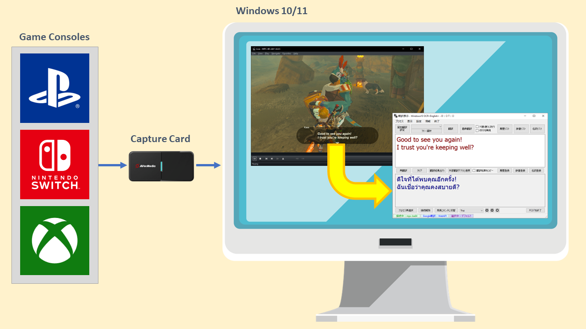

# แปลเกมเป็นภาษาไทยแบบเรียลไทม์ด้วยโปรแกรม PCOT
ปรับปรุงล่าสุด: 14 ส.ค. 2566

<kbd></kbd>

 - [แนะนำโปรแกรม](#แนะนำโปรแกรม)
   - [เปรียบเทียบ Google Lens กับ PCOT](#เปรียบเทียบ-google-lens-กับ-pcot)
 - [การติดตั้งโปรแกรม](Setup.md#การติดตั้งโปรแกรม)
   - [การติดตั้งโปรแกรม PCOT](Setup.md#การติดตั้งโปรแกรม-pcot)
   - [การติดตั้งโปรแกรม Microsoft Visual C++ 2015-2022 Runtime Libraries](Setup.md#การติดตั้งโปรแกรม-microsoft-visual-c-2015-2022-runtime-libraries)
   - [การติดตั้งโปรแกรม MPC-BE Portable](Setup.md#การติดตั้งโปรแกรม-mpc-be-portable)
 - [การตั้งค่าโปรแกรม](Config.md#การตั้งค่าโปรแกรม)
   - [การตั้งค่าโปรแกรม MPC-BE](Config.md#การตั้งค่าโปรแกรม-mpc-be)
   - [การตั้งค่าโปรแกรม PCOT](Config.md#การตั้งค่าโปรแกรม-pcot)
     - [การตั้งค่าเริ่มต้น](Config.md#การตั้งค่าเริ่มต้น)
     - [การเพิ่มภาษาสำหรับ Tesseract OCR](Config.md#การเพิ่มภาษาสำหรับ-tesseract-ocr)
 - [การใช้งาน MPC-BE](Usage.md#การใช้งาน-mpc-be)
 - [การใช้งาน PCOT](Usage.md#การใช้งาน-pcot)
   - [การแปลภาษาแบบ Free Selection](Usage.md#การแปลภาษาแบบ-free-selection)
   - [การแปลภาษาแบบ Fixed Translation](Usage.md#การแปลภาษาแบบ-fixed-translation)
     - [การสร้างรายการ Fixed Translation](Usage.md#การสร้างรายการ-fixed-translation)
     - [การแก้ไขรายการ Fixed Translation](Usage.md#การแก้ไขรายการ-fixed-translation)
     - [การลบรายการ Fixed Translation](Usage.md#การลบรายการ-fixed-translation)
   - [Windows 10 OCR Engine](Usage.md#windows-10-ocr-engine)
     - [การเพิ่มภาษาสำหรับ Windows 10 OCR](Usage.md#การเพิ่มภาษาสำหรับ-windows-10-ocr)
   - [การตั้งค่าการอ่าน OCR](Usage.md#การตั้งค่าการอ่าน-ocr)
   - [Image Processing](Usage.md#image-processing)
 - [PCOT Tips](Tips.md#pcot-tips)
   - [การสร้างโพรเซสนามแฝง เพื่อให้ Fixed Translation เปลี่ยนไปตามเกมต่าง ๆ](Tips.md#การสร้างโพรเซสนามแฝง-เพื่อให้-fixed-translation-เปลี่ยนไปตามเกมต่าง-ๆ)
   - [เทคนิคเพิ่มความแม่นยำในการแปลให้ดีขึ้น](Tips.md#เทคนิคเพิ่มความแม่นยำในการแปลให้ดีขึ้น)
   - [PCOT Simple Mode](Tips.md#pcot-simple-mode)
 - [ภาษาญี่ปุ่นทั้งหมด](#ภาษาญี่ปุ่นทั้งหมด)
 - [ข้อมูลอ้างอิง](#ข้อมูลอ้างอิง)

## แนะนำโปรแกรม

<kbd></kbd>

<kbd></kbd>

<kbd></kbd>

โปรแกรม [PCOT](http://www.gc-net.jp/s_54/) ย่อมาจาก <ins>P</ins>rocess <ins>C</ins>onnect <ins>O</ins>CR <ins>T</ins>ranslator เป็น translation support tools โดยคุณ Nuruppo ที่ใช้เทคโนโลยี[การรู้จำอักขระด้วยแสง (OCR)](https://th.wikipedia.org/wiki/การรู้จำอักขระด้วยแสง) รวมเข้ากับ[การแปลด้วยเครื่อง (machine translation)](https://th.wikipedia.org/wiki/การแปลด้วยเครื่อง) โดยใช้บริการแปลภาษาจาก Google Translate และ [Microsoft DeepL Translate](https://www.deepl.com/en/windows-app/) ทำให้การแปลภาษาจากรูปภาพเป็นเรื่องที่ง่ายเพียงแค่คลิกเดียวเท่านั้น

เดิมที PCOT ถูกพัฒนามาเพื่อแปลภาษาในเกมส์บน Windows เป็นหลัก แต่ตัวผมเองนำมาประยุกต์ให้ใช้แปลเกมส์จากเครื่อง [Nintendo Switch](https://www.nintendo.com/th/switch/index.html) (หรือเครื่องเล่นเกมส์อื่น ๆ) ผ่านการใช้งาน HDMI capture card โดยแสดงหน้าจอเกมส์ด้วยโปรแกรม [MPC-BE](https://www.videohelp.com/software/MPC-BE)

เหตุผลที่เลือก PCOT + MPC-BE เพื่อใช้แปลภาษาจากเกมส์เนื่องจาก
 - โปรแกรมมีขนาดเล็ก ทั้งสองโปรแกรมรวมกันไม่ถึง 40 MB และไม่จำเป็นต้องติดตั้งโปรแกรม เพียงแค่แตกไฟล์ก็พร้อมใช้งานได้ทันที
   - ขนาดไฟล์ที่ download
     - **PCOT v1.6.0:** 26,522,036 bytes
     - **MPC-BE v1.6.8.5 (x64):** 13,380,429 bytes
 - PCOT สามารถตั้งค่า image processing ได้ ช่วยให้แปลภาษาแม่นยำมากขึ้น
 - ฟรี ไม่มีค่าใช้จ่าย

ส่วนข้อเสียของ PCOT ก็อาจจะเป็นโปรแกรมที่คุณ Nuruppo พัฒนามาเพื่อใช้งานส่วนตัวเป็นหลัก (อ้างอิงจากบทสัมภาษณ์จาก [GameSpark](https://www.gamespark.jp/article/2021/07/02/110097.html)) ทำให้หน้าจอโปรแกรมมีแค่ภาษาญี่ปุ่นเท่านั้น, ไม่มีคู่มือสอนการใช้งาน (แต่ก็มีคนญี่ปุ่นหลาย ๆ ท่านทำคลิปสอบพร้อมคำบรรยายภาษาอังกฤษ เช่น [Yamachannel](https://www.youtube.com/watch?v=hvPRcvR8bCo) เป็นต้น) ซึ่งบทความนี้ก็จะแนะนำการติดตั้งและใช้งาน PCOT เบื้องต้นให้เป็นขั้นตอนที่สามารถทำตามได้ด้วยตนเอง แต่จะไม่ได้รวมถึงถึงการแปลด้วย DeepL เนื่องจาก DeepL ยังไม่ได้รองรับการแปลเป็นภาษาไทย หากอนาคตรองรับผมจะกลับมาอัพเดทเพิ่มเติมให้ครับ

### เปรียบเทียบ Google Lens กับ PCOT

ถึงแม้ Google Lens และ PCOT จะสามารถแปลภาษาได้ด้วยกันทั้งคู่ แต่วิธีการใช้งาน การปรับแต่งค่าต่าง ๆ ค่อนข้างแตกต่างกัน ผมขอสรุปความแตกต่างในส่วนที่เราใช้แปลเกมส์เป็นภาษาไทยแบบเรียลไทม์ไว้ดังนี้ครับ

|Google Lens|PCOT|
|-|-|
|ใช้งานผ่านโปรแกรมบนมือถือโดยโฟกัสไปที่ภาษาต้นฉบับพื่อแปลภาษา|ใช้งานผ่านโปรแกรมบนเครื่องคอมพิวเตอร์โดยระบุพื้นที่หน้าจอเพื่อแปลภาษา|
|แสดงภาษาที่ต้องการคำแปลแทนที่ภาษาต้นฉบับ|แสดงภาษาที่ต้องการคำแปลในโปรแกรม PCOT|
|ไม่สามารถกำหนดพื้นที่ที่ต้องการแปลภาษาไว้ล่วงหน้าได้|สามารถกำหนดพื้นที่หน้าจอที่ต้องการแปลภาษาไว้ล่วงหน้าได้ เพิ่มความสะดวกในการแปลภาษา|
|ตั้งค่า image processing ไม่ได้|ตั้งค่า image processing ได้ ช่วยให้แปลภาษาแม่นยำมากขึ้น|
|เลือกใช้ OCR engine ไม่ได้|เลือกใช้ [Tesseract OCR](https://github.com/tesseract-ocr/tesseract) หรือ Windows 10 OCR ได้|
|ใช้บริการจาก Google Translate เท่านั้น|เลือกใช้บริการจาก Google Translate และ Microsoft DeepL Translate ได้พร้อมกัน|

## [การติดตั้งโปรแกรม](Setup.md#การติดตั้งโปรแกรม)

กดที่หัวข้อด้านบนของบรรทัดนี้เพื่ออ่านต่อนะครับ เนื่องจากใส่รูปในหน้าเดียวกันมากเกินไปจน GitHub ban เลยต้องแบ่งเป็นหน้าย่อย ๆ ครับ

## [การตั้งค่าโปรแกรม](Config.md#การตั้งค่าโปรแกรม)

กดที่หัวข้อด้านบนของบรรทัดนี้เพื่ออ่านต่อนะครับ เนื่องจากใส่รูปในหน้าเดียวกันมากเกินไปจน GitHub ban เลยต้องแบ่งเป็นหน้าย่อย ๆ ครับ

## [การใช้งาน MPC-BE](Usage.md#การใช้งาน-mpc-be)

กดที่หัวข้อด้านบนของบรรทัดนี้เพื่ออ่านต่อนะครับ เนื่องจากใส่รูปในหน้าเดียวกันมากเกินไปจน GitHub ban เลยต้องแบ่งเป็นหน้าย่อย ๆ ครับ

## [การใช้งาน PCOT](Usage.md#การใช้งาน-pcot)

กดที่หัวข้อด้านบนของบรรทัดนี้เพื่ออ่านต่อนะครับ เนื่องจากใส่รูปในหน้าเดียวกันมากเกินไปจน GitHub ban เลยต้องแบ่งเป็นหน้าย่อย ๆ ครับ

## [PCOT Tips](Tips.md#pcot-tips)

กดที่หัวข้อด้านบนของบรรทัดนี้เพื่ออ่านต่อนะครับ เนื่องจากใส่รูปในหน้าเดียวกันมากเกินไปจน GitHub ban เลยต้องแบ่งเป็นหน้าย่อย ๆ ครับ

## ภาษาญี่ปุ่นทั้งหมด

### เมนู

 - **プロセス** Process
   - **プロセス再選択** Process reselection
   - **プロセス接続解除** Process disconnect
   - **プロセス再接続** Process reconnection
 - **表示** Express
   - **シンプル表示** Simple display
 - **設定** Setting
   - **システム設定** System setting
   - **画像加工＆OCR読取設定** Image processing & OCR reading settings
   - **OCR言語設定** OCR language setting
   - **改行詳細設定** Advanced line break settings
   - **翻訳機能を無効** Disable translation function
 - **情報** Information
 - **終了** End
   - **PCOTを終了** Exit PCOT

### แถบเครื่องมือด้านบน

 - **固定翻訳設定** Fixed translation settings
 - **フリー選択** Free selection
 - **翻訳** Translation
 - **画像翻訳** Image translation
 - **対象通りに改行** Line breaks as intended
 - **改行を無視** Ignore newlines
 - **履歴リスト** History list
 - **辞書リスト** Dictionary list
 - **名詞リスト** Noun list

### แถบเครื่องมือตรงกลาง

 - **再翻訳** Retranslation
 - **クリア** Clear
 - **翻訳結果出力** Translation result output
 - **外部翻訳アプリと連携** Works with external translation apps
 - **翻訳結果をコピー** Copy translation result
 - **履歴登録** History registration
 - **辞書登録** Dictionary registration
 - **名詞登録** Noun registration

### แถบเครื่องมือด้านล่าง

 - **プロセス再選択** Process reselection
 - **接続解除** Disconnect
 - **簡易コマンドに切替** Switch to simple command
 - **PCOTを終了** Exit PCOT

## ข้อมูลอ้างอิง
 - [Guide :: Recommended Screen Translation Software](https://steamcommunity.com/sharedfiles/filedetails/?id=2847675160)
 - [画面翻訳で簡単に日本語化可能！"PCOT"の使い方ガイド](https://steamcommunity.com/sharedfiles/filedetails/?id=2649183272)
 - [PCOTで日本未対応のゲームを簡単翻訳！便利な機能と使い方を紹介](https://yamachannel-blog.com/game-translation/)
 - [PCOTで日本語未対応のゲームを簡単翻訳！導入方法と基本的な使い方を紹介](https://yamachannel-blog.com/game-translation-pcot/)
 - [An Experimental Performance Analysis on Robotics Process Automation (RPA) With Open Source OCR Engines: Microsoft Ocr And Google Tesseract OCR](https://iopscience.iop.org/article/10.1088/1757-899X/1059/1/012004)
