# แปลเกมเป็นภาษาไทยแบบเรียลไทม์ด้วยโปรแกรม PCOT [Draft 2023/08/02]
ปรับปรุงล่าสุด: 2 ส.ค. 2566

 - [แนะนำโปรแกรม](#แนะนำโปรแกรม)
   - [เปรียบเทียบ Google Lens กับ PCOT](#เปรียบเทียบ-google-lens-กับ-pcot)
 - [การติดตั้งโปรแกรม](#การติดตั้งโปรแกรม)
   - [การติดตั้งโปรแกรม PCOT](#การติดตั้งโปรแกรม-pcot)
   - [การติดตั้งโปรแกรม Microsoft Visual C++ 2015-2022 Runtime Libraries](#การติดตั้งโปรแกรม-microsoft-visual-c-2015-2022-runtime-libraries)
   - [การติดตั้งโปรแกรม MPC-BE Portable](#การติดตั้งโปรแกรม-mpc-be-portable)
 - [การตั้งค่าโปรแกรม](#การตั้งค่าโปรแกรม)
   - [การตั้งค่าโปรแกรม MPC-BE](#การตั้งค่าโปรแกรม-mpc-be)
   - [การตั้งค่าโปรแกรม PCOT](#การตั้งค่าโปรแกรม-pcot)
     - [การตั้งค่าเริ่มต้น](#การตั้งค่าเริ่มต้น)
     - [การเพิ่มภาษาสำหรับ Tesseract OCR](#การเพิ่มภาษาสำหรับ-tesseract-ocr)
 - [การใช้งาน MPC-BE](#การใช้งาน-mpc-be)
 - [การใช้งาน PCOT](#การใช้งาน-pcot)
   - [การแปลภาษาแบบ Free Selection](#การแปลภาษาแบบ-free-selection)
   - [การแปลภาษาแบบ Fixed Translation](#การแปลภาษาแบบ-fixed-translation)
     - [การสร้างรายการ Fixed Translation](#การสร้างรายการ-fixed-translation)
     - [การแก้ไขรายการ Fixed Translation](#การแก้ไขรายการ-fixed-translation)
     - [การลบรายการ Fixed Translation](#การลบรายการ-fixed-translation)
   - [Windows 10 OCR Engine](#windows-10-ocr-engine)
     - [การเพิ่มภาษาสำหรับ Windows 10 OCR](#การเพิ่มภาษาสำหรับ-windows-10-ocr)
   - [การตั้งค่าการอ่าน OCR](#การตั้งค่าการอ่าน-ocr)
   - [Image Processing](#image-processing)
 - [PCOT Tips](#)
   - [การสร้างชื่อเล่นโพรเซส เพื่อให้ Fixed Translation เปลี่ยนไปตามเกมต่าง ๆ](#)
   - [เทคนิคเพิ่มความแม่นยำในการแปลให้ดีขึ้น](#)
 - [ข้อมูลอ้างอิง](#ข้อมูลอ้างอิง)

## แนะนำโปรแกรม

โปรแกรม [PCOT](http://www.gc-net.jp/s_54/) ย่อมาจาก <ins>P</ins>rocess <ins>C</ins>onnect <ins>O</ins>CR <ins>T</ins>ranslator เป็น translation support tools โดยคุณ Nuruppo ที่ใช้เทคโนโลยี[การรู้จำอักขระด้วยแสง (OCR)](https://th.wikipedia.org/wiki/การรู้จำอักขระด้วยแสง) รวมเข้ากับ[การแปลด้วยเครื่อง (machine translation)](https://th.wikipedia.org/wiki/การแปลด้วยเครื่อง) โดยใช้บริการแปลภาษาจาก Google Translate และ [Microsoft DeepL Translate](https://www.deepl.com/en/windows-app/) ทำให้การแปลภาษาจากรูปภาพเป็นเรื่องที่ง่ายเพียงแค่คลิกเดียวเท่านั้น

เดิมที PCOT ถูกพัฒนามาเพื่อแปลภาษาในเกมส์บน Windows เป็นหลัก แต่ตัวผมเองนำมาประยุกต์ให้ใช้แปลเกมส์จากเครื่อง [Nintendo Switch](https://www.nintendo.com/th/switch/index.html) (หรือเครื่องเล่นเกมส์อื่น ๆ) ผ่านการใช้งาน HDMI capture card โดยแสดงหน้าจอเกมส์ด้วยโปรแกรม [MPC-BE](https://www.videohelp.com/software/MPC-BE)

เหตุผลที่เลือก PCOT + MPC-BE เพื่อใช้แปลภาษาจากเกมส์เนื่องจาก
 - โปรแกรมมีขนาดเล็ก ทั้งสองโปรแกรมรวมกันไม่ถึง 40 MB และไม่จำเป็นต้องติดตั้งโปรแกรม เพียงแค่แตกไฟล์ก็พร้อมใช้งานได้ทันที
   - ขนาดไฟล์ที่ download
     - **PCOT v1.6.0:** 26,522,036 bytes
     - **MPC-BE v1.6.8.5 (x64):** 13,380,429 bytes
 - PCOT สามารถตั้งค่า image processing ได้ ช่วยให้แปลภาษาแม่นยำมากขึ้น
 - ฟรี ไม่มีค่าใช้จ่าย

ส่วนข้อเสียของ PCOT ก็อาจจะเป็นโปรแกรมที่คุณ Nuruppo พัฒนามาเพื่อใช้งานส่วนตัวเป็นหลัก (อ้างอิงจากบทสัมภาษณ์จาก [GameSpark](https://www.gamespark.jp/article/2021/07/02/110097.html)) ทำให้หน้าจอโปรแกรมมีแค่ภาษาญี่ปุ่นเท่านั้น, ไม่มีคู่มือสอนการใช้งาน (แต่ก็มีคนญี่ปุ่นหลาย ๆ ท่านทำคลิปสอบพร้อมคำบรรยายภาษาอังกฤษ เช่น [Yamachannel](https://www.youtube.com/watch?v=hvPRcvR8bCo) เป็นต้น) ซึ่งบทความนี้ก็จะแนะนำการติดตั้งและใช้งาน PCOT เบื้องต้นให้เป็นขั้นตอนที่สามารถทำตามได้ด้วยตนเอง แต่จะไม่ได้รวมถึงถึงการแปลด้วย DeepL เนื่องจาก DeepL ยังไม่ได้รองรับการแปลเป็นภาษาไทย หากอนาคตรองรับผมจะกลับมาอัพเดทเพิ่มเติมให้ครับ

### เปรียบเทียบ Google Lens กับ PCOT

ถึงแม้ Google Lens และ PCOT จะสามารถแปลภาษาได้ด้วยกันทั้งคู่ แต่วิธีการใช้งาน การปรับแต่งค่าต่าง ๆ ค่อนข้างแตกต่างกัน ผมขอสรุปความแตกต่างในส่วนที่เราใช้แปลเกมส์เป็นภาษาไทยแบบเรียลไทม์ไว้ดังนี้ครับ

|Google Lens|PCOT|
|-|-|
|ใช้งานผ่านโปรแกรมบนมือถือโดยโฟกัสไปที่ภาษาต้นฉบับพื่อแปลภาษา|ใช้งานผ่านโปรแกรมบนเครื่องคอมพิวเตอร์โดยระบุพื้นที่หน้าจอเพื่อแปลภาษา|
|แสดงภาษาที่ต้องการคำแปลแทนที่ภาษาต้นฉบับ|แสดงภาษาที่ต้องการคำแปลในโปรแกรม PCOT|
|ไม่สามารถกำหนดพื้นที่ที่ต้องการแปลภาษาไว้ล่วงหน้าได้|สามารถกำหนดพื้นที่หน้าจอที่ต้องการแปลภาษาไว้ล่วงหน้าได้ เพิ่มความสะดวกในการแปลภาษา|
|ตั้งค่า image processing ไม่ได้|ตั้งค่า image processing ได้ ช่วยให้แปลภาษาแม่นยำมากขึ้น|
|เลือกใช้ OCR engine ไม่ได้|เลือกใช้ [Tesseract OCR](https://github.com/tesseract-ocr/tesseract) หรือ Windows 10 OCR ได้|
|ใช้บริการจาก Google Translate เท่านั้น|เลือกใช้บริการจาก Google Translate และ Microsoft DeepL Translate ได้พร้อมกัน|

## การติดตั้งโปรแกรม

### การติดตั้งโปรแกรม PCOT

 - เปิดไปที่เวป [PCOT](http://www.gc-net.jp/s_54/)
 - กดปุ่ม **"DL"** จะ link ไปยังไฟล์ที่เก็บอยู่ใน Microsoft OneDrive
   
   <kbd></kbd>
 - กดปุ่ม **"Download"**
   
   <kbd></kbd>

 - เมื่อ download ไฟล์เสร็จแล้ว ให้แตกไฟล์ไปไว้ที่ **"C:\Translator"** หรือโฟลเดอร์อื่น ๆ ตามที่ต้องการ

   <kbd></kbd>
 - **ไฟล์ mod language.dat เป็นภาษาอังกฤษ:** ผมได้แก้ไขไฟล์รายชื่อภาษา OCR จากภาษาญี่ปุ่นให้เป็นภาษาอังกฤษเพื่อความสะดวกในการเลือกภาษาต้นฉบับ แนะนำให้ติดตั้งเพิ่มเติมเพื่อความสะดวกในการใช้งานครับ
   
   |ไฟล์ language.dat ต้นฉบับ|ไฟล์ mod language.dat เป็นภาษาอังกฤษ|
   |:-:|:-:|
   |||
   - เปิดไปที่ [/tessdata/PCOT_1.6.0/language.zip](/tessdata/PCOT_1.6.0/language.zip)
   - กดปุ่ม **"Download raw file"**
  
     <kbd>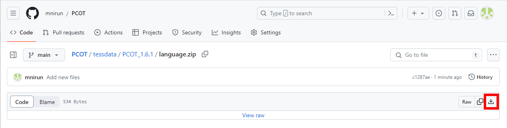</kbd>
   - แตกไฟล์ **"language.zip"** ไปไว้ที่ **"C:\Translator\PCOT\tessdata\\"** ทับไฟล์ **"language.dat"** เดิม
  
     <kbd></kbd>

### การติดตั้งโปรแกรม Microsoft Visual C++ 2015-2022 Runtime Libraries

การใช้งาน PCOT จำเป็นต้องติดตั้ง [Microsoft Visual C++ 2015-2022 Runtime Libraries](https://learn.microsoft.com/en-us/cpp/windows/latest-supported-vc-redist?view=msvc-170) ก่อน หากในเครื่องคอมพิวเตอร์ติดตั้งไว้แล้ว (ทดสอบง่าย ๆ โดยให้ลองรันไฟล์ **"C:\Translator\PCOT\PCOT.exe"** หากรันได้แสดงว่าได้ติดตั้ง runtime libraries ไว้แล้ว) สามารถข้ามขั้นตอนนี้ไปยังขั้นตอน[การติดตั้งโปรแกรม MPC-BE Portable](#การติดตั้งโปรแกรม-mpc-be-portable) ได้เลย

 - ทำการ download Microsoft Visual C++ 2015-2022 Runtime Libraries โดยเลือกรุ่น Windows ให้ตรงกับที่ใช้งาน
   - **x64:** [https://aka.ms/vs/17/release/vc_redist.x64.exe](https://aka.ms/vs/17/release/vc_redist.x64.exe)
   - **x86:** [https://aka.ms/vs/17/release/vc_redist.x86.exe](https://aka.ms/vs/17/release/vc_redist.x86.exe)

 - รันไฟล์ Microsoft Visual C++ 2015-2022 Runtime Libraries ติ๊กถูกที่ **"I agree to the license terms and conditions"** แล้วกดปุ่ม **"Install"**
   
   <kbd></kbd>
 - รอจนโปรแกรมติดตั้งเสร็จ แล้วกดปุ่ม **"Close"**
   
   <kbd></kbd>

 - ข้อมูลเพิ่มเติม
   - [Windows รุ่น 32 บิตและ 64 บิต: คำถามที่ถามบ่อย](https://support.microsoft.com/th-th/windows/windows-รุ่น-32-บิตและ-64-บิต-คำถามที่ถามบ่อย-c6ca9541-8dce-4d48-0415-94a3faa2e13d)

### การติดตั้งโปรแกรม MPC-BE Portable

MPC-BE โปรแกรมเล่นสื่อมัลติมีเดีย รองรับการแสดงหน้าจอจาก HDMI capture card ผ่านเมนู **"Capture Device..."**

- ทำการ download [MPC-BE](https://www.videohelp.com/software/MPC-BE) โดยเลือกรุ่น Windows ให้ตรงกับที่ใช้งาน
  - **x64:** [MPC-BE.1.6.8.5.x64](https://www.videohelp.com/download/MPC-BE.1.6.8.5.x64.7z)
  - **x86:** [MPC-BE.1.6.8.5.x86](https://www.videohelp.com/download/MPC-BE.1.6.8.5.x86.7z)
- เมื่อ download ไฟล์เสร็จแล้ว ให้แตกไฟล์ไปไว้ที่ **"C:\Translator"** หรือโฟลเดอร์อื่น ๆ ตามที่ต้องการ

   <kbd></kbd>

- ข้อมูลเพิ่มเติม
  - [Windows รุ่น 32 บิตและ 64 บิต: คำถามที่ถามบ่อย](https://support.microsoft.com/th-th/windows/windows-รุ่น-32-บิตและ-64-บิต-คำถามที่ถามบ่อย-c6ca9541-8dce-4d48-0415-94a3faa2e13d)

## การตั้งค่าโปรแกรม

ในการใช้งานโปรแกรมครั้งแรก เราต้องตั้งค่าต่าง ๆ ให้พร้อมใช้แปลภาษาจากเกมส์ ดังนี้

### การตั้งค่าโปรแกรม MPC-BE

 - รันไฟล์ **"C:\Translator\MPC-BE.1.6.8.5.x64\mpc-be64.exe"** แล้วกดที่ **"<ins>More info</ins>"**

   <kbd></kbd>
 - กดปุ่ม **"Run anyway"**

   <kbd></kbd>
 - ไปที่เมนู **"View"** → **"Option..."**

   <kbd></kbd>
 - ทางด้านซ้าย ให้เลือก **"Player"** → หัวข้อ **"Location of settings"** ให้เลือกรายการ **"Player folder"**

   <kbd></kbd>
  - ทางด้านซ้าย ให้เลือก **"Mouse"** → หัวข้อ **"Left button"** ให้เลือกรายการ **""** ว่าง ๆ ดังรูป

    <kbd></kbd>
 - ทางด้านซ้าย ให้เลือก **"Capture"** → รายการ **"Video"** ให้เลือกชื่อ HDMI capture card ที่รับสัญญาณ HDMI มาจากเครื่องเล่นเกมส์ หากต้องการฟังเสียงจากเครื่องเล่นเกมส์ด้วย ให้เลือก รายการ **"Audio"** เพิ่มเติม แต่หากฟังเสียงโดยเสียบหูฟังที่เครื่องโดยตรงก็ไม่ต้องเปลี่ยนหัวข้อนี้

   <kbd></kbd>
 - กดปุ่ม **"OK"** ทางด้านล่าง

   <kbd></kbd>
 - เสร็จสิ้นการตั้งค่าโปรแกรม MPC-BE

### การตั้งค่าโปรแกรม PCOT

#### การตั้งค่าเริ่มต้น

 - รันไฟล์ **"C:\Translator\PCOT\PCOT.exe"** แล้วกดที่ **"<ins>More info</ins>"**

   <kbd></kbd>
 - กดปุ่ม **"Run anyway"**

   <kbd></kbd>
 - โปรแกรมจะแสดงหน้าจอโพรเซส (Process) ที่เราต้องการแปลภาษา ในที่นี้เราจะเลือกรายการที่ **"タイトル (Title)"** ชื่อว่า **"MPC-BE x64 1.6.8.5"** หรือดูจากรายการที่ **"プロセス名 (Process name)"** ชื่อว่า **"mpc-be64"** ก็ได้เช่นกัน จากนั้นให้กดปุ่ม **"選択 (Selection)"** ทางด้านล่าง

   <kbd></kbd>
 - ที่มุมล่างซ้ายของโปรแกรมจะแสดงชื่อโพรเซสที่ทำการเชื่อต่ออยู่ **"接続中 (Connecting)"**

   <kbd></kbd>
 - ไปที่เมนู **"設定 (Setting)"** → **"システム設定 (System setting)"**

   <kbd></kbd>
 - ที่หน้าต่าง **"PCOTシステム設定  (PCOT system settings)"** เราจะทำการเปลี่ยนฟอนต์ในหัวข้อ **"フォント設定 (Font settings)"** เพื่อให้อ่านข้อความได้ง่ายขึ้น
   - กดที่ปุ่ม **"原文フォント設定 (Source font setting)"** เพื่อเปลี่ยนฟอนต์ภาษาต้นฉบับ
     
     <kbd></kbd>
     
     <kbd></kbd>
   - กดที่ปุ่ม **"訳文フォント設定 (Translation font setting)"** เพื่อเปลี่ยนฟอนต์ภาษาที่ต้องการคำแปล

     <kbd></kbd>

     <kbd></kbd>
 - เมื่อเปลี่ยนฟอนต์เสร็จแล้ว ให้ติ๊กถูกที่ **"終了時に画面の座標とサイズを記憶 (Remember screen coordinates and size on exit)"** เพื่อให้ PCOT จำตำแหน่งและขนาดหน้าจอเมื่อปิดโปรแกรม

   <kbd></kbd>
 - ติ๊กถูกที่ **"範囲選択時に対象プロセスのスレッドを停止 (Stop the thread of the target process when selecting a range)"** เพื่อหยุดภาพบนหน้าจอของเกมระหว่างการใช้เมาส์ลากคลุมพื้นที่ ช่วยให้แปลงข้อความได้เร็วขึ้น โดยเฉพาะเกมที่ฉากหลังขยับไปมาด้วยความรวดเร็ว

   <kbd></kbd>
 - ที่รายการ **"OCR読取失敗時の挙動： ... 秒後に閉じる (OCR read failure behavior: Close after ... seconds)"** ให้เปลี่ยนเป็นเลข 1 เพื่อให้ PCOT ปิดหน้าจอการอ่าน OCR หากตรวจไม่พบตัวอักษรบนหน้าจอ หลังจากผ่านไป 1 วินาที

   <kbd></kbd>
 - จากนั้นให้
   - กดปุ่ม **"確定 (Confirm)"** เพื่อยืนยันการตั้งค่า
   - หรือกดปุ่ม **"キャンセル (Cancel)"** ขวาสุด เพื่อยกเลิกการตั้งค่า
   - หรือกดปุ่ม **"リセット (Reset)"** ซ้ายสุด เพื่อรีเซ็ตเป็นค่าเริ่มต้น

     <kbd></kbd>

#### การเพิ่มภาษาสำหรับ Tesseract OCR

ในการแปลภาษาจากเกมส์ต่าง ๆ จำเป็นต้อง download [ไฟล์ภาษาของ Tesseract OCR](https://tesseract-ocr.github.io/tessdoc/Data-Files.html) เพื่อให้โปรแกรม PCOT สามารถอ่านข้อความในเกมส์แล้วแปลงออกมาเป็นตัวอักษร (OCR) เพื่อใช้แปลภาษา (Translate) ต่อไป ขั้นตอนการติดตั้งภาษาต่าง ๆ มีดังนี้

 - ไปที่เมนู **"設定 (Setting)"** → **"OCR言語設定 (OCR language setting)"**

   <kbd></kbd>
 - ที่หน้าต่าง **"Tesseract OCR言語設定 (Tesseract OCR Language Settings)"** จะแสดงรายการภาษาต้นฉบับต่าง ๆ ที่ PCOT รองรับ **"対応言語一覧：(List of supported languages：)"** รายการภาษาต้นฉบับที่มีเครื่องหมาย **"\* (ดอกจัน)"** นำหน้าชื่อภาษา แสดงว่าเราได้ download ภาษาต้นฉบับนั้นและ PCOT พร้อมใช้งาน OCR แล้ว โดย PCOT ที่เราได้ download ตอนต้นจะมาพร้อมกับภาษาอังกฤษและไม่สามารถลบภาษานี้ออกจาก PCOT ได้ โดยในกรอบสี่เหลี่ยมด้านล่างจะแสดงข้อความว่า **"利用可能(削除不可) (Available (cannot be deleted))"** และปุ่ม **"削除 (Delete)"** จะไม่สามารถกดได้

   <kbd></kbd>
 - ในตอนนี้เราจะทดลอง download ภาษาต้นฉบับญี่ปุ่นเพิ่มเติม ในรายการ **"対応言語一覧：(List of supported languages：)"** ให้เลือก **"Japanese"** โดยในกรอบสี่เหลี่ยมด้านล่างจะแสดงข้อความว่า **"Tesseract OCRの言語データがありません (Missing language data for Tesseract OCR)"**

   <kbd></kbd>
 - กดปุ่ม **"追加/更新 (Add/Update)"** เพื่อ download ภาษาต้นฉบับญี่ปุ่น

   <kbd>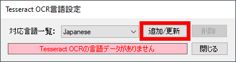</kbd>
 - รอให้ PCOT download ภาษาต้นฉบับสักครู่

   <kbd></kbd>

   <kbd></kbd>
 - เมื่อ download เสร็จแล้ว ให้กดปุ่ม **"OK"** เป็นอันเสร็จสิ้นการเพิ่มภาษาต้นฉบับของ Tesseract OCR

   <kbd></kbd>
 - ให้ทำการเพิ่มภาษาต้นฉบับต่าง ๆ ที่ต้องการให้ครบถ้วนตามขั้นตอนข้างต้น
 - กดปุ่ม **"閉じる (Close)"** เพื่อปิดหน้าต่าง **"Tesseract OCR言語設定 (Tesseract OCR Language Settings)"**

   <kbd></kbd>

## การใช้งาน MPC-BE

 - เสียบสาย HDMI จากเครื่องเล่นเกมส์เข้าไปที่ HDMI capture card
 - หากใช้ external HDMI capture card ให้เสียบสาย USB/Thunderbolt จาก capture card ไปที่คอมพิวเตอร์
 - รันไฟล์ **"C:\Translator\MPC-BE.1.6.8.5.x64\mpc-be64.exe"**
 - ไปที่เมนู **"File"** → **"Open Device..."**

   <kbd>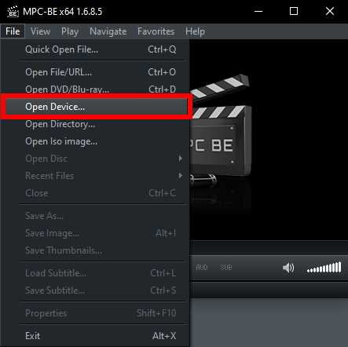</kbd>
 - จะปรากฎหน้าจอเครื่องเล่นเกมส์ในโปรแกรม MPC-BE

   <kbd></kbd>
 - สามารถปรับขนาดหน้าจะได้จากเมนู **"View"** → **"Zoom"** หรือกดแป้นพิมพ์ลัด
   - <kbd>Alt</kbd> + <kbd>1</kbd> = 50%
   - <kbd>Alt</kbd> + <kbd>2</kbd> = 100%
   - <kbd>Alt</kbd> + <kbd>3</kbd> = 200%
   - <kbd>Alt</kbd> + <kbd>4</kbd> = Auto Fit

   <kbd></kbd>

## การใช้งาน PCOT

PCOT รองรับการแปลภาษา 2 รูปแบบ ได้แก่
 - **Free Selection:** ใช้เมาส์ลากคลุมพื้นที่หน้าจอที่ต้องการแปลภาษาจากหน้าจอเกมส์โดยอิสระ เพื่อความสะดวกในการแปลภาษา
 - **Fixed Translation:** กำหนดพื้นที่หน้าจอที่ต้องการแปลภาษาจากหน้าจอเกมส์ไว้ล่วงหน้า เพื่อความรวดเร็วในการแปลภาษา

 <kbd></kbd>

### การแปลภาษาแบบ Free Selection

 - เมื่อเปิดโปรแกรมเข้ามาแล้ว ให้ตรวจสอบ OCR engine, ภาษาต้นฉบับ (source language) และ ภาษาที่ต้องการคำแปล (translate language) ที่ใช้งานอยู่ได้จากตำแหน่งต่าง ๆ ดังรูปด้านล่าง

   <kbd>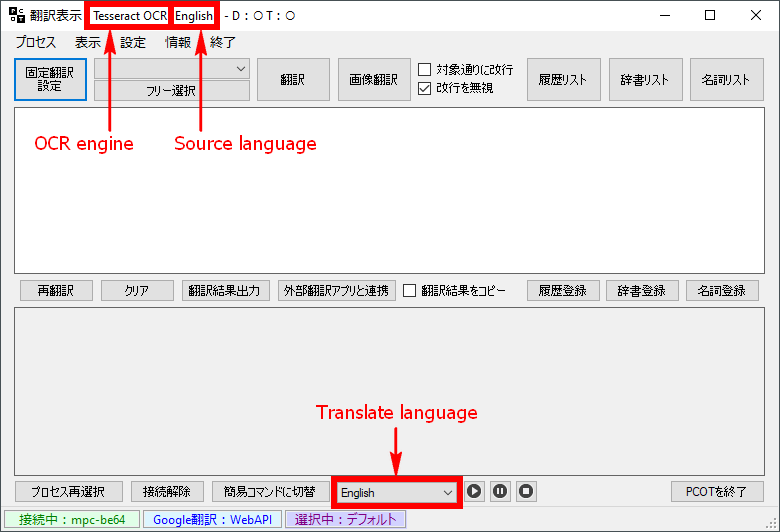</kbd>
 - หากต้องการเปลี่ยนภาษาต้นฉบับให้ไปที่เมนู **"設定 (Setting)"** → **"画像加工＆OCR読取設定 (Image processing & OCR reading settings)"**

   <kbd></kbd>
 - ที่หน้าต่าง **"画像加工&OCR読取設定 (Image processing & OCR reading settings)"** → **"OCR読取設定 (OCR scan settings)"** ให้เลือกภาษาต้นฉบับที่ต้องการจากรายการ **"OCR読取言語：(OCR reading language：)"** แล้วกดปุ่ม **"保存 (Save)"** เพื่อบันทึกการตั้งค่า

   <kbd></kbd>
 - กดปุ่ม **"X"** ที่มุมบนขวาเพื่อปิดหน้าต่าง

   <kbd></kbd>
 - เลือกภาษาที่ต้องการคำแปลทางด้านล่างให้เป็น **"Thai"**

   <kbd></kbd>
 - กดปุ่ม **"フリー選択 (Free selection)"** หรือกดแป้นพิมพ์ลัด <kbd>Ctrl</kbd> + <kbd>Shift</kbd> + <kbd>F</kbd>

   <kbd></kbd>
 - หน้าจอ MPC-BE จะมืดลง ให้ใช้เมาส์ลากคลุมพื้นที่หน้าจอที่ต้องการแปลภาษา

   <kbd>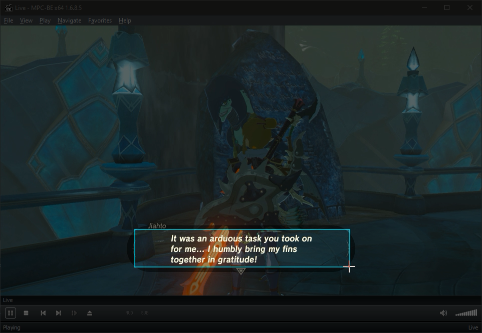</kbd>
 - PCOT จะทำการอ่านภาษาต้นฉบับจากรูปภาพในเกมแล้วแปลงออกมาเป็นตัวอักษรลงในช่อง **"原文テキストボックス (Original text box)"** ด้านบน และทำการแปลภาษาลงในช่อง **"訳文テキストボックス (Translation text box)"** ด่านล่าง
   
   <kbd></kbd>
 - หากต้องการแปลข้อความใหม่ในพื้นที่หน้าจอเดิม ให้กดปุ่ม **"翻訳 (Translation)"** หรือกดแป้นพิมพ์ลัด <kbd>Ctrl</kbd> + <kbd>Shift</kbd> + <kbd>0</kbd> โปรแกรมจะอ่านข้อความแล้วแปลภาษาในทันที

   <kbd></kbd>

   <kbd></kbd>

   <kbd></kbd>

 - จากรูปด้านบนจะพบว่า Tesseract OCR แปลงตัวอักษรผิดพลาด จากตัวไอใหญ่ **"I"** เป็นเลขหนึ่ง **"1"** เราสามารถแก้ไขข้อความต้นฉบับให้ถูกต้องแล้วกดปุ่ม **"再翻訳 (Retranslation)"** เพื่อแปลข้อความใหม่อีกครั้ง

   <kbd></kbd>

   <kbd>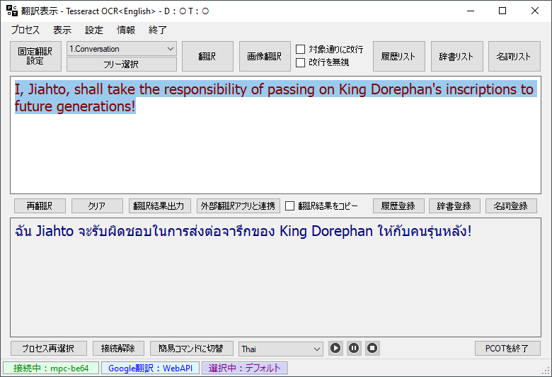</kbd>
 - หาก OCR แปลงข้อความบรรทัดต่อบรรทัดทำให้ขาดความต่อเนื่องในการแปลภาษา เราสามารถติ๊กถูกที่ **"改行を無視 (Ignore newlines)"** ทางด้านบนให้รวมข้อความเป็นบรรทัดเดียวกันแล้วกดปุ่ม **"再翻訳 (Retranslation)"** เพื่อแปลข้อความใหม่อีกครั้ง

   <kbd></kbd>

   <kbd></kbd>

   <kbd>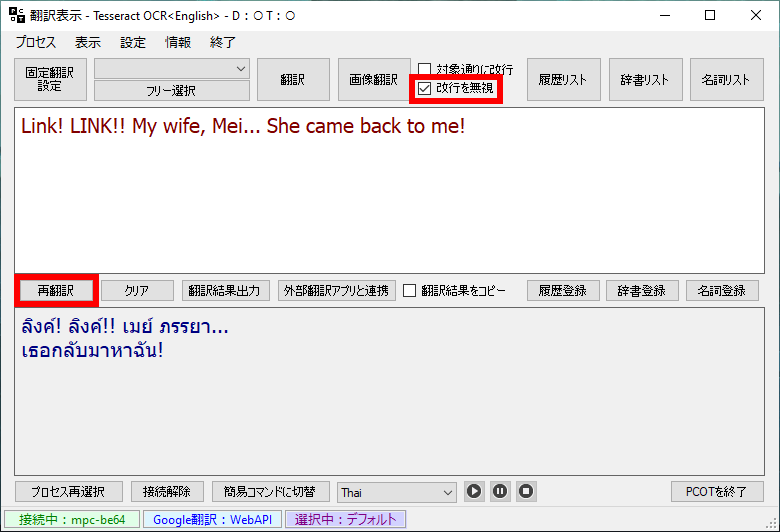</kbd>

   <kbd></kbd>

### การแปลภาษาแบบ Fixed Translation

#### การสร้างรายการ Fixed Translation

 - เมื่อเปิดโปรแกรมเข้ามาแล้ว ให้กดปุ่ม **"固定翻訳設定 (Fixed translation settings)"**

   <kbd></kbd>
 - ที่หน้าต่าง **"固定翻訳タイトル設定 (Fixed translation title setting)"** ให้พิมพ์ชื่อรายการการแปลในช่องด้านขวา เช่น **"Conversation"** เป็นต้น

   <kbd></kbd>
 - เลือกภาษาต้นฉบับ **"言語 (Language)"** ให้ถูกต้อง

   <kbd></kbd>
 - กดปุ่ม **"新規作成 (Create new)"** เพื่อสร้างรายการ fixed translation

   <kbd>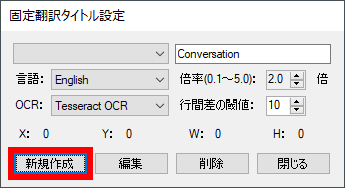</kbd>
 - หน้าจอ MPC-BE จะมืดลง ให้ใช้เมาส์ลากคลุมพื้นที่หน้าจอที่ต้องการแปลภาษา

   <kbd>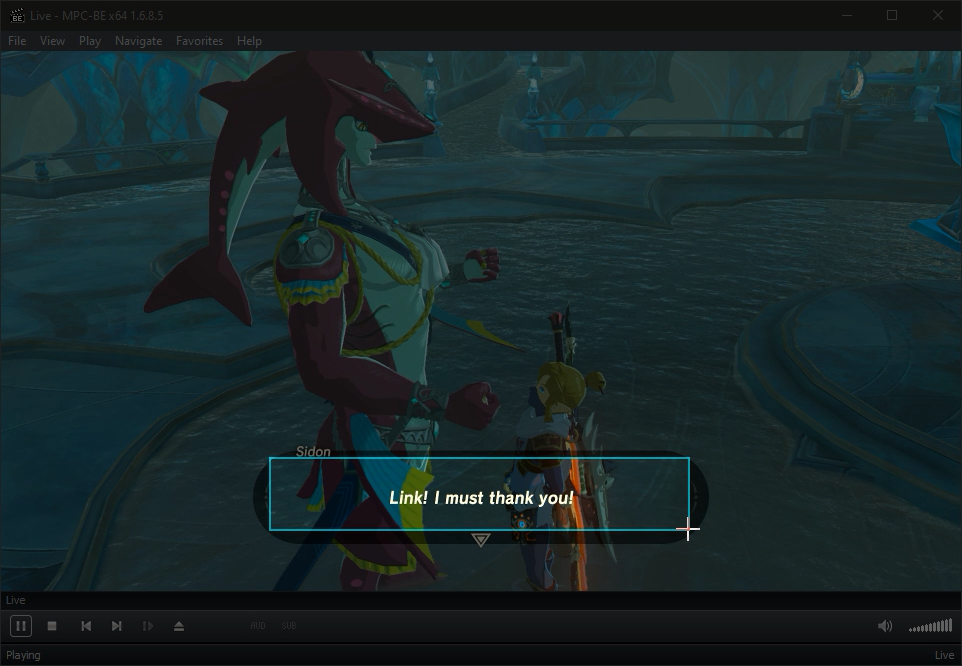</kbd>
 - PCOT จะแปลภาษาพร้อมกับสร้างรายการ fixed translation ให้ ดังรูปด้านล่าง

   <kbd></kbd>
 - หากต้องการแปลภาษาในพื้นที่หน้าจอที่ได้สร้างรายการไว้แล้ว เพียงแค่เลือกรายการ fixed translation ที่ต้องการแล้วกดปุ่ม **"翻訳 (Translation)"** PCOT ก็จะคลุมพื้นที่หน้าจอที่ต้องการแล้วแปลภาษาให้โดยอัตโนมัติ หรือจะกดแป้นพิมพ์ลัด <kbd>Ctrl</kbd> + <kbd>Shift</kbd> + <kbd>1</kbd> (1 = เลขลำดับรายการ fixed translation, สูงสุด 9 รายการ) ก็ได้เช่นกัน

   <kbd></kbd>

   <kbd></kbd>

   <kbd></kbd>
 - ลองสร้างรายการ fixed translation ที่ 2 ด้วยการกดปุ่ม **"固定翻訳設定 (Fixed translation settings)"**

   <kbd></kbd>
 - ที่หน้าต่าง **"固定翻訳タイトル設定 (Fixed translation title setting)"** ให้ลบชื่อรายการเก่าแล้วพิมพ์ชื่อรายการใหม่ลงไป เช่น **"An inventory description"** เป็นต้น

   <kbd></kbd>

   <kbd></kbd>
 - กดปุ่ม **"新規作成 (Create new)"** เพื่อสร้างรายการ fixed translation

   <kbd></kbd>
 - หน้าจอ MPC-BE จะมืดลง ให้ใช้เมาส์ลากคลุมพื้นที่หน้าจอที่ต้องการแปลภาษา

    <kbd></kbd>
 - PCOT จะแปลภาษาพร้อมกับสร้างรายการ fixed translation ให้ใหม่ ดังรูปด้านล่าง

   <kbd></kbd>
 - ลองตรวจสอบรายการ fixed translation จะพบว่าลำดับรายการได้เปลี่ยนไปเนื่องจาก PCOT เรียงลำดับรายการตามตัวอักษร ทำให้แป้นพิมพ์ลัดเปลี่ยนใหม่เป็น
   - <kbd>Ctrl</kbd> + <kbd>Shift</kbd> + <kbd>1</kbd> = **"An inventory description"**
   - <kbd>Ctrl</kbd> + <kbd>Shift</kbd> + <kbd>2</kbd> = **"Conversation"**

   <kbd>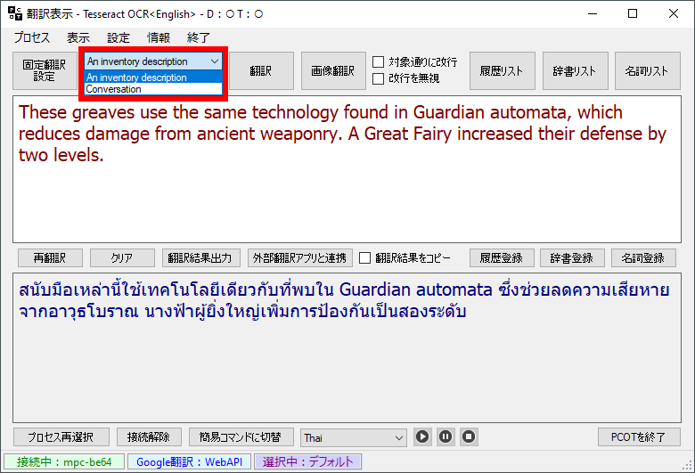</kbd>
 - หากต้องการให้รายการ fixed translation เรียงตามลำดับที่ต้องการ ให้ใส่ตัวเลขนำหน้าตอนที่สร้างรายการใหม่ เช่น
   - **"1. Conversation"**
   - **"2. An inventory description"**

#### การแก้ไขรายการ Fixed Translation

 - เมื่อเปิดโปรแกรมเข้ามาแล้ว ให้กดปุ่ม **"固定翻訳設定 (Fixed translation settings)"**

   <kbd></kbd>
 - เลือกรายการ fixed translation ที่ต้องการแก้ไขพื้นที่หน้าจอใหม่ ตัวอย่างเช่น พื้นที่เดิมไม่ครอบคลุมข้อความทั้งหมด, ขนาดหน้าจอของ MPC-BE เปลี่ยนไป เป็นต้น

   <kbd></kbd>
 - กดปุ่ม **"編集 (Edit)"**

   <kbd>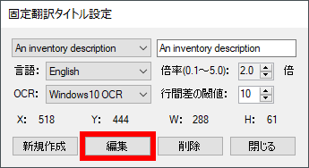</kbd>
 - โปรแกรมจะแสดงข้อความ **"編集内容を保存しました。続けて翻訳範囲を編集しますか？ (Your edits have been saved. Do you want to continue editing the translation range?)"** ให้กดปุ่ม **"Yes"**

   <kbd></kbd>
 - หน้าจอ MPC-BE จะมืดลง ให้ใช้เมาส์ลากคลุมพื้นที่หน้าจอที่ต้องการแปลภาษา
 - PCOT จะแปลภาษาพร้อมกับอัพเดทพื้นที่หน้าจอของรายการ fixed translation ให้ใหม่

#### การลบรายการ Fixed Translation

 - เมื่อเปิดโปรแกรมเข้ามาแล้ว ให้กดปุ่ม **"固定翻訳設定 (Fixed translation settings)"**

   <kbd></kbd>
 - เลือกรายการ fixed translation ที่ต้องการลบ

   <kbd></kbd>
 - กดปุ่ม **"削除 (Delete)"**

   <kbd></kbd>
 - โปรแกรมจะแสดงข้อความ **"選択中の項目を削除します。設定されたデータが全て削除されます。よろしいですか？ (Delete the selected item. All set data will be deleted. Is it OK?)"** ให้กดปุ่ม **"Yes"**

   <kbd></kbd>
 - กดปุ่ม **"閉じる (Close)"**

   <kbd></kbd>

### Windows 10 OCR Engine

PCOT รองรับการใช้งาน Tesseract OCR engine และ Windows 10 OCR engine จากประสบการณ์ใช้งานส่วนตัวและจากวารสารสืบเนื่องจากการประชุมวิชาการระดับนานาชาติ IOP Conference Series: Materials Science and Engineering เรื่อง [An Experimental Performance Analysis on Robotics Process Automation (RPA) With Open Source OCR Engines: Microsoft Ocr And Google Tesseract OCR](https://iopscience.iop.org/article/10.1088/1757-899X/1059/1/012004) พบว่า Windows OCR engine ให้ผลลัพธ์ที่แม่นยำกว่า Tesseract OCR engine แต่ในบางกรณี Tesseract OCR engine ให้ผลลัพธ์ที่ดีกว่า Windows OCR engine

ผมเลือกใช้ Windows 10 OCR engine เป็นหลัก เนื่องจากให้ผลลัพธ์ที่แม่นยำกว่าและทำงานได้เร็วกว่า Tesseract OCR engine

ไม่มี OCR engine ตัวไหนที่ดีที่สุด ทดลองเล่นแล้วเลือกใช้ให้เหมาะกับเกมส์ต่าง ๆ ดูนะครับ **"One size doesn't fit all"**

|หน้าจอเกมที่ใช้ทดสอบ #1|
|:-:|
|<kbd></kbd>|

|ผลการทดสอบ #1 ด้วย Tesseract OCR engine|ผลการทดสอบ #1 ด้วย Windows 10 OCR engine|
|-|-|
|<kbd></kbd>|<kbd></kbd>|
|Are you supporting Link in his flzght? Is there really nothing more 乃 can do?|Are you supporting Link in his fight? Is there really nothing more I can do?|
|คุณสนับสนุน Link ใน flzght ของเขาหรือไม่? ไม่มีอะไรที่乃จะทำได้อีกแล้วจริงๆหรือ?|คุณสนับสนุนลิงค์ในการต่อสู้ของเขาหรือไม่? ไม่มีอะไรที่ฉันทำได้อีกแล้วจริงๆเหรอ?|

|หน้าจอเกมที่ใช้ทดสอบ #2|
|:-:|
|<kbd></kbd>|

|ผลการทดสอบ #2 ด้วย Tesseract OCR engine|ผลการทดสอบ #2 ด้วย Windows 10 OCR engine|
|-|-|
|<kbd></kbd>|<kbd></kbd>|
|OK, OK, I‘ve got this. Greeting time. You‘re a customer, right?|0K, 0K, I've got this. Greeting time. You're a customer, right?|
|ตกลง ตกลง ฉันมีสิ่งนี้ เวลาทักทาย. คุณเป็นลูกค้าใช่ไหม|0K 0K ฉันมีสิ่งนี้ เวลาทักทาย. คุณเป็นลูกค้าใช่ไหม|

#### การเพิ่มภาษาสำหรับ Windows 10 OCR

ก่อนทำการเพิ่มภาษาสำหรับ Windows 10 OCR ผมขอบอกข้อจำกัดของ PCOT OCR ก็คือเราต้อง[เพิ่มภาษาสำหรับ Tesseract OCR](#การเพิ่มภาษาสำหรับ-tesseract-ocr) ก่อน จึงจะสามารถเลือกใช้งาน Windows 10 OCR ในภาษานั้นได้ ถึงแม้เราจะไม่ต้องการใช้ Tesseract OCR ในภาษานั้นเลยก็ตาม

ยกตัวอย่างเช่น หากต้องการแปลภาษาญี่ปุ่น (Japanese) ก็ต้องเพิ่มภาษาญี่ปุ่นสำหรับ Tesseract OCR เข้ามาก่อน แล้วค่อยเพิ่มภาษาญี่ปุ่นสำหรับ Windows 10 OCR หากไม่เพิ่มภาษาญี่ปุ่นสำหรับ Tesseract OCR เข้ามาก่อนก็จะไม่มีภาษาญี่ปุ่นให้เลือกในรายการภาษาต้นฉบับครับ

ขั้นตอนการเพิ่มภาษาสำหรับ Windows 10 OCR มีดังนี้

- กดแป้นพิมพ์ลัด <kbd>Win</kbd> + <kbd>I</kbd> เพื่อเปิดหน้าต่าง **"Settings"** → **"Time & Language"**

  <kbd></kbd>
- ทางด้านซ้าย ให้เลือกรายการ **"Language"**

  <kbd></kbd>
- ทางด้านขวา ให้เลือกรายการ **"Add a language"**

  <kbd></kbd>
- พิมพ์ชื่อภาษาที่ต้องการทางด้านบน

  <kbd></kbd>
- เลือกภาษาที่ต้องการ แล้วกดปุ่ม **"Next"**

  <kbd>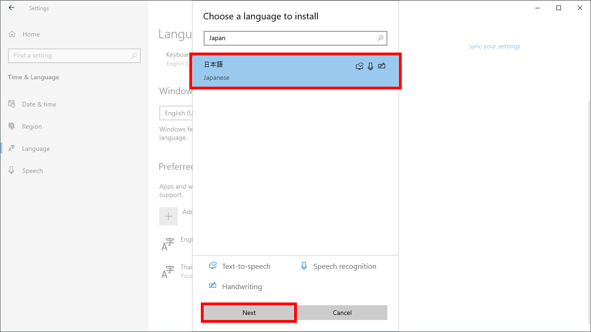</kbd>
- เอาเครื่องหมายถูกจากรายการด้านบนออกให้หมด เนื่องจากเราต้องการใช้แค่ **"Optical character recognition"** ทางด้านล่างเท่านั้น แล้วกดปุ่ม **"Install"**

  <kbd></kbd>
- จะปรากฎหน้าต่าง **"User Access Control"** ขึ้นมา ให้กดปุ่ม **"Yes"**
- สามารถตรวจสอบสถานะการเพิ่มภาษาได้โดยกดที่ชื่อภาษา แล้วกดปุ่ม **"Options"**

  <kbd></kbd>
- รอสักครู่

  <kbd></kbd>
- เมื่อเสร็จสิ้นการเพิ่มภาษาแล้ว ให้กดปุ่ม **"X"**

  <kbd></kbd>
- เสร็จสิ้นการเพิ่มภาษาสำหรับ Windows 10 OCR

### การตั้งค่าการอ่าน OCR

เราสามารถตั้งค่าการอ่าน OCR ของ free selection และ fixed translation ต่าง ๆ ได้ดังนี้

 - ไปที่เมนู **"設定 (Setting)"** → **"画像加工＆OCR読取設定 (Image processing & OCR reading settings)"**

   <kbd></kbd>
 - ที่หน้าต่าง **"画像加工&OCR読取設定 (Image processing & OCR reading settings)"** ให้กดปุ่ม **"設定選択 (Setting selection)"**

   <kbd></kbd>
 - ที่หน้าต่าง **"設定選択：mpc-be64 (Setting selection: mpc-be64)"** ให้เลือกรายการที่ต้องการตั้งค่า ในที่นี้จะเลือกรายการ **"デフォルト (Default)"** ซึ่งเป็นรายการที่ใช้สำหรับ free selection โดยเฉพาะ จากนั้นให้กดปุ่ม **"選択 (Selection)"**

   <kbd></kbd>
 - ตั้งค่าต่าง ๆ ที่ต้องการ เช่น ภาษาต้นฉบับ, OCR engine เป็นต้น เมื่อตั้งค่าเสร็จแล้ว ให้กดปุ่ม **"保存 (Save)"**

   <kbd></kbd>
 - กดปุ่ม **"X"** ที่มุมบนขวาเพื่อปิดหน้าต่าง

   <kbd></kbd>

### Image Processing

ก่อนที่จะทำการแปลงข้อความ (OCR) การใช้การประมวลภาพ (image processing) จะช่วยให้การแปลภาษาแม่นยำขึ้น

<kbd></kbd>

#### แนะนำเครื่องมือที่ใช้งาน

 - **カラー設定 (Color setting):** ใช้ปรับความสว่างของภาพ "明度 (Brightness)", ความอิ่มตัวของสี "彩度 (Saturation)", แปลงภาพสีให้เป็นภาพขาวดํา "グレースケール (Grayscale)"
 - **白黒二値化設定 (Black and white binarization setting):** แปลงภาพสีให้เป็นภาพขาวดํา 2 ระดับ

ผมจะขอยกตัวอย่างการใช้งาน image processing สัก 2-3 กรณี เพื่อให้เข้าใจเครื่องมือต่าง ๆ, หลักการใช้งาน และการนำไปประยุกต์ใช้ในเกมต่าง ๆ ได้ เนื่องจาก image processing ไม่มีสูตรตายตัว เกมเดียวกัน ข้อความตำแหน่งเดียวกัน แต่พื้นหลังต่างกัน ค่า image processing ก็ต่างกันครับ

#### Image Processing ตัวอย่างที่ 1: ตัวอักษรบนฉากหลังสีพื้น

## ข้อมูลอ้างอิง
 - [Guide :: Recommended Screen Translation Software](https://steamcommunity.com/sharedfiles/filedetails/?id=2847675160)
 - [画面翻訳で簡単に日本語化可能！"PCOT"の使い方ガイド](https://steamcommunity.com/sharedfiles/filedetails/?id=2649183272)
 - [PCOTで日本未対応のゲームを簡単翻訳！便利な機能と使い方を紹介](https://yamachannel-blog.com/game-translation/)
 - [PCOTで日本語未対応のゲームを簡単翻訳！導入方法と基本的な使い方を紹介](https://yamachannel-blog.com/game-translation-pcot/)
 - [An Experimental Performance Analysis on Robotics Process Automation (RPA) With Open Source OCR Engines: Microsoft Ocr And Google Tesseract OCR](https://iopscience.iop.org/article/10.1088/1757-899X/1059/1/012004)
