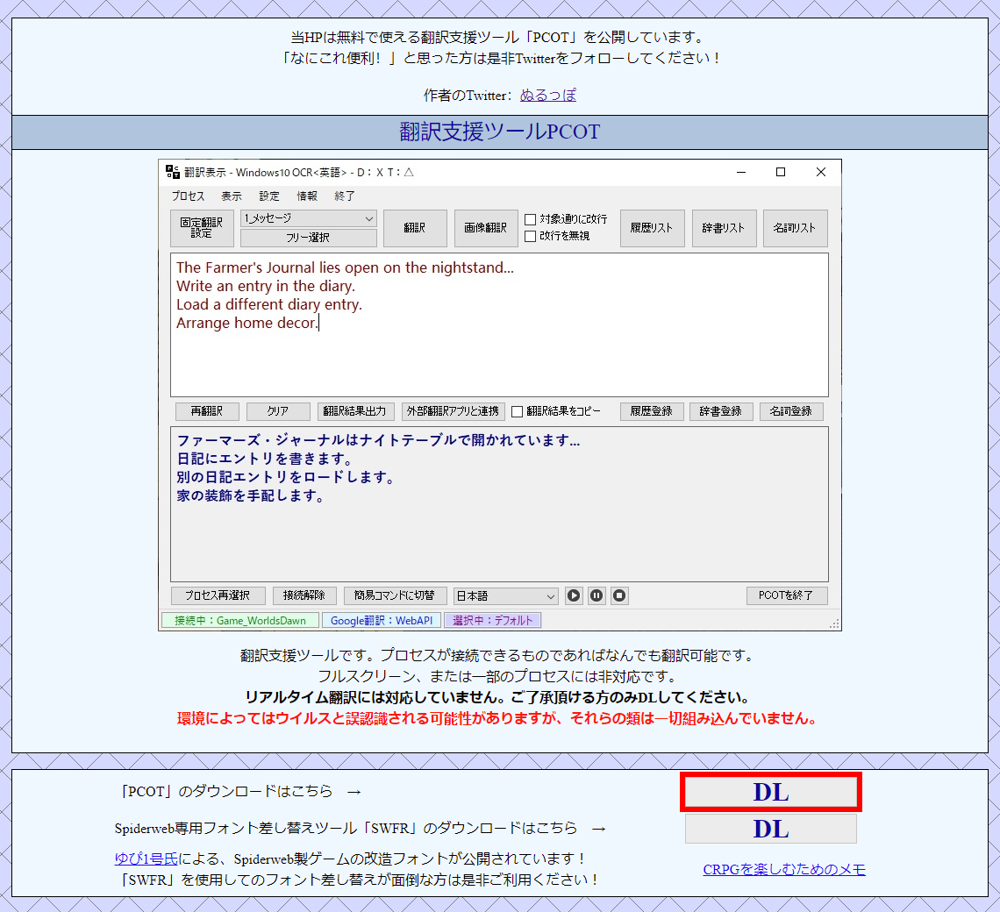
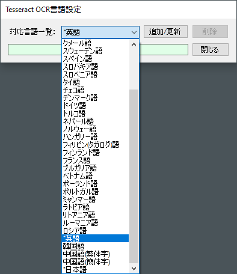
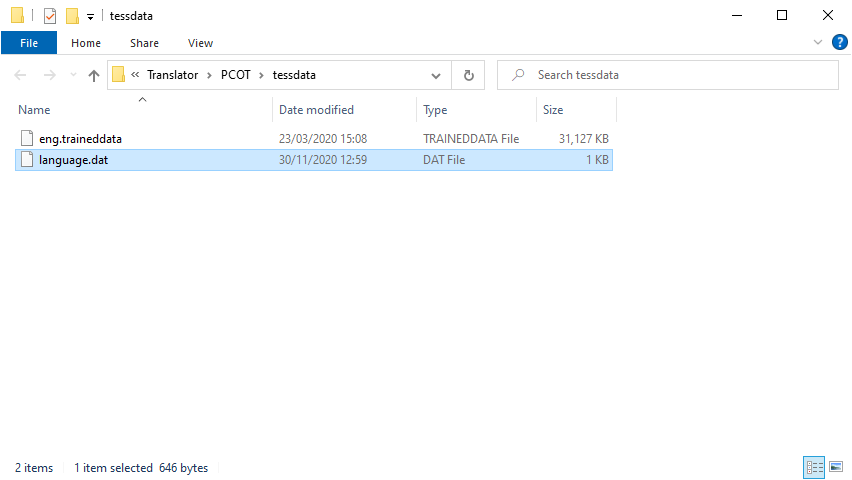
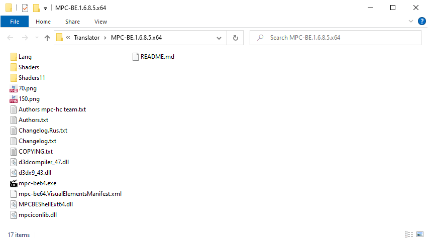

# แปลเกมเป็นภาษาไทยแบบเรียลไทม์ด้วยโปรแกรม PCOT: การติดตั้งโปรแกรม
ปรับปรุงล่าสุด: 14 ส.ค. 2566

 - [การติดตั้งโปรแกรม](#การติดตั้งโปรแกรม)
   - [การติดตั้งโปรแกรม PCOT](#การติดตั้งโปรแกรม-pcot)
   - [การติดตั้งโปรแกรม Microsoft Visual C++ 2015-2022 Runtime Libraries](#การติดตั้งโปรแกรม-microsoft-visual-c-2015-2022-runtime-libraries)
   - [การติดตั้งโปรแกรม MPC-BE Portable](#การติดตั้งโปรแกรม-mpc-be-portable)

## การติดตั้งโปรแกรม

### การติดตั้งโปรแกรม PCOT

 - เปิดไปที่เวป [PCOT](http://www.gc-net.jp/s_54/)
 - กดปุ่ม **"DL"** จะ link ไปยังไฟล์ที่เก็บอยู่ใน Microsoft OneDrive
   
   <kbd></kbd>
 - กดปุ่ม **"Download"**
   
   <kbd></kbd>

 - เมื่อ download ไฟล์เสร็จแล้ว ให้แตกไฟล์ไปไว้ที่ **"C:\Translator"** หรือโฟลเดอร์อื่น ๆ ตามที่ต้องการ

   <kbd></kbd>
 - **ไฟล์ mod language.dat เป็นภาษาอังกฤษ:** ผมได้แก้ไขไฟล์รายชื่อภาษา OCR จากภาษาญี่ปุ่นให้เป็นภาษาอังกฤษเพื่อความสะดวกในการเลือกภาษาต้นฉบับ แนะนำให้ติดตั้งเพิ่มเติมเพื่อความสะดวกในการใช้งานครับ
   
   |ไฟล์ language.dat ต้นฉบับ|ไฟล์ mod language.dat เป็นภาษาอังกฤษ|
   |:-:|:-:|
   |||
   - เปิดไปที่ [/tessdata/PCOT_1.6.0/language.zip](/tessdata/PCOT_1.6.0/language.zip)
   - กดปุ่ม **"Download raw file"**
  
     <kbd></kbd>
   - แตกไฟล์ **"language.zip"** ไปไว้ที่ **"C:\Translator\PCOT\tessdata\\"** ทับไฟล์ **"language.dat"** เดิม
  
     <kbd></kbd>

### การติดตั้งโปรแกรม Microsoft Visual C++ 2015-2022 Runtime Libraries

การใช้งาน PCOT จำเป็นต้องติดตั้ง [Microsoft Visual C++ 2015-2022 Runtime Libraries](https://learn.microsoft.com/en-us/cpp/windows/latest-supported-vc-redist?view=msvc-170) ก่อน หากในเครื่องคอมพิวเตอร์ติดตั้งไว้แล้ว (ทดสอบง่าย ๆ โดยให้ลองรันไฟล์ **"C:\Translator\PCOT\PCOT.exe"** หากรันได้แสดงว่าได้ติดตั้ง runtime libraries ไว้แล้ว) สามารถข้ามขั้นตอนนี้ไปยังขั้นตอน[การติดตั้งโปรแกรม MPC-BE Portable](#การติดตั้งโปรแกรม-mpc-be-portable) ได้เลย

 - ทำการ download Microsoft Visual C++ 2015-2022 Runtime Libraries โดยเลือกรุ่น Windows ให้ตรงกับที่ใช้งาน
   - **x64:** [https://aka.ms/vs/17/release/vc_redist.x64.exe](https://aka.ms/vs/17/release/vc_redist.x64.exe)
   - **x86:** [https://aka.ms/vs/17/release/vc_redist.x86.exe](https://aka.ms/vs/17/release/vc_redist.x86.exe)

 - รันไฟล์ Microsoft Visual C++ 2015-2022 Runtime Libraries ติ๊กถูกที่ **"I agree to the license terms and conditions"** แล้วกดปุ่ม **"Install"**
   
   <kbd></kbd>
 - รอจนโปรแกรมติดตั้งเสร็จ แล้วกดปุ่ม **"Close"**
   
   <kbd></kbd>

 - ข้อมูลเพิ่มเติม
   - [Windows รุ่น 32 บิตและ 64 บิต: คำถามที่ถามบ่อย](https://support.microsoft.com/th-th/windows/windows-รุ่น-32-บิตและ-64-บิต-คำถามที่ถามบ่อย-c6ca9541-8dce-4d48-0415-94a3faa2e13d)

### การติดตั้งโปรแกรม MPC-BE Portable

MPC-BE โปรแกรมเล่นสื่อมัลติมีเดีย รองรับการแสดงหน้าจอจาก HDMI capture card ผ่านเมนู **"Capture Device..."**

- ทำการ download [MPC-BE](https://www.videohelp.com/software/MPC-BE) โดยเลือกรุ่น Windows ให้ตรงกับที่ใช้งาน
  - **x64:** [MPC-BE.1.6.8.5.x64](https://www.videohelp.com/download/MPC-BE.1.6.8.5.x64.7z)
  - **x86:** [MPC-BE.1.6.8.5.x86](https://www.videohelp.com/download/MPC-BE.1.6.8.5.x86.7z)
- เมื่อ download ไฟล์เสร็จแล้ว ให้แตกไฟล์ไปไว้ที่ **"C:\Translator"** หรือโฟลเดอร์อื่น ๆ ตามที่ต้องการ

   <kbd></kbd>

- ข้อมูลเพิ่มเติม
  - [Windows รุ่น 32 บิตและ 64 บิต: คำถามที่ถามบ่อย](https://support.microsoft.com/th-th/windows/windows-รุ่น-32-บิตและ-64-บิต-คำถามที่ถามบ่อย-c6ca9541-8dce-4d48-0415-94a3faa2e13d)
