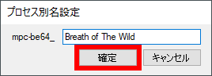
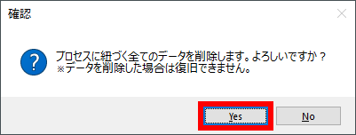
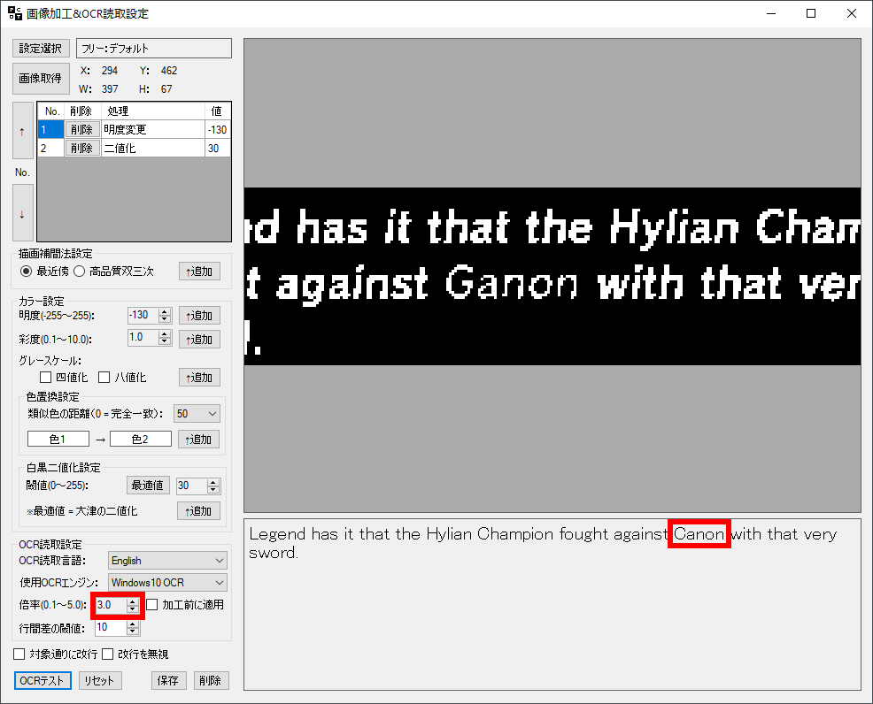
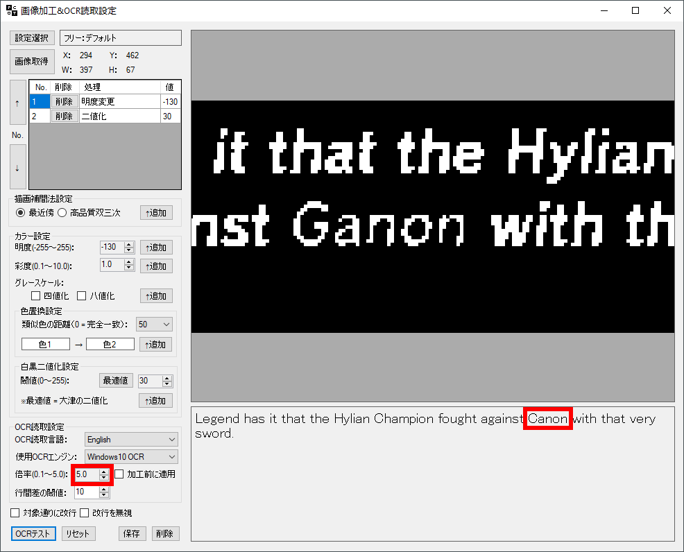

# แปลเกมเป็นภาษาไทยแบบเรียลไทม์ด้วยโปรแกรม PCOT: PCOT Tips
ปรับปรุงล่าสุด: 15 ส.ค. 2566

 - [PCOT Tips](#pcot-tips)
   - [การสร้างโพรเซสนามแฝง เพื่อให้ Fixed Translation เปลี่ยนไปตามเกมต่าง ๆ](#การสร้างโพรเซสนามแฝง-เพื่อให้-fixed-translation-เปลี่ยนไปตามเกมต่าง-ๆ)
   - [เทคนิคเพิ่มความแม่นยำในการแปลให้ดีขึ้น](#เทคนิคเพิ่มความแม่นยำในการแปลให้ดีขึ้น)
   - [เทคนิคเพิ่มความแม่นยำในการแปลให้ดีขึ้นไปอีกด้วย tessdata_best](#เทคนิคเพิ่มความแม่นยำในการแปลให้ดีขึ้นไปอีกด้วย-tessdata_best)
   - [Free Selection ภายใน Fixed Translation](#free-selection-ภายใน-fixed-translation)
   - [PCOT Simple Mode](#pcot-simple-mode)
 - [ข้อมูลอ้างอิง](#ข้อมูลอ้างอิง)

## PCOT Tips
 
### การสร้างโพรเซสนามแฝง เพื่อให้ Fixed Translation เปลี่ยนไปตามเกมต่าง ๆ

 - ที่หน้าจอโพรเซส ให้กดปุ่ม **"追加 (Addition)"** ด้านหลังรายการโพรเซสที่ชื่อว่า **"mpc-be64"**

   <kbd></kbd>
 - จะปรากฎหน้าต่าง โพรเซสนามแฝง **"プロセス別名設定 (process aliasing)"** ตั้งชื่อนามแฝงที่ต้องการ แล้วกดปุ่ม **"確定 (Confirm)"**

   <kbd></kbd>

   <kbd></kbd>

   <kbd></kbd>
 - เลือกรายการโพรเซสนามแฝงที่ได้สร้างขึ้นมาใหม่ แล้วกดปุ่ม **"選択 (Selection)"**

   <kbd></kbd>
 - PCOT จะแสดงชื่อโพรเซสนามแฝงไว้ที่มุมล่างซ้ายของโปรแกรม โดยในหน้าต่างโพรเซสนามแฝงนี้จะไม่มีรายการ fixed translation มาให้ เราจึงสามารถสร้าง fixed translation แยกตามเกมที่เราเล่นได้

   <kbd></kbd>
 - หากต้องการกลับไปที่หน้าจอโพรเซส ให้กดปุ่ม **"プロセス再選択 (Process reselection)"** ทางด้านล่างซ้าย

   <kbd></kbd>
 - ทดลองสร้างโพรเซสนามแฝงขึ้นมาใหม่ แล้วกดปุ่ม **"選択 (Selection)"**

   <kbd></kbd>
 - PCOT จะแสดงชื่อโพรเซสนามแฝงใหม่ไว้ที่มุมล่างซ้ายของโปรแกรม

   <kbd></kbd>
 - หากต้องการลบการตั้งค่าต่าง ๆ ไม่ว่าจะเป็นโพรเซสหลัก หรือโพรเซสนามแฝง ให้กลับไปที่หน้าจอโพรเซส แล้วกดปุ่ม **"削除 (Delete)"** ที่อยู่ด้านหลังสุดของรายการโพรเซส PCOT จะแสดงข้อความว่า **"プロセスに紐づく全てのデータを削除します。よろしいですか？※データを削除した場合は復旧できません。 (Delete all data associated with the process. Is it OK? ※If data is deleted, it cannot be recovered.)"** ให้กดปุ่ม **"Yes"**

   <kbd></kbd>

   <kbd></kbd>

### เทคนิคเพิ่มความแม่นยำในการแปลให้ดีขึ้น

 เราสามารถเพิ่มความแม่นยำในการแปลให้ดีขึ้นได้ 2-3 วิธี ได้แก่

  #### ปรับหน้าจอ MPE-BE ให้ใหญ่ขึ้น

 การปรับหน้าจอ MPE-BE ให้ใหญ่ขึ้น ไม่ว่าจะเป็นการเพิ่มขนาดหน้าจอ เช่น จาก 50% → 100% หรือ Fullscreen ช่วยให้ตัวอักษรของเกมขยายใหญ่ขึ้น OCR อ่านตัวอักษรได้แม่นยำขึ้น ยกตัวอย่างเช่น

 - หน้าขอ MPC-BE 50% ตัวอักษรสีแดงพื้นหลังสีมืด คำว่า "Ganon" ดูแล้วน่าจะอ่านได้ไม่ยาก แต่ OCR กลับอ่านเป็นคำว่า "Canon" แทน

   <kbd></kbd>

   <kbd></kbd>
 - ลองขยายภาพจาก 3.0 ไปเป็น 5.0 ผลลัพธ์ก็เหมือนเดิม

   <kbd></kbd>

   <kbd></kbd>
 - ทดลองขยายหน้าจอเป็น 100% OCR สามารถอ่านข้อความได้ถูกต้อง

   <kbd></kbd>

   <kbd></kbd>

   <kbd></kbd>

 - เปรียบเทียบหน้าจอที่ขยายด้วยการใช้เครื่องมือ **"倍率 (Magnification)"** ในโปรแกรม PCOT กับขยายด้วยโปรแกรม MPC-BE ถึงจะได้ขนาดตัวอักษรพอกัน แต่ผลลัพธ์กลับต่างกัน การขยายหน้าจอที่ต้นทางให้ใหญ่ที่สุดจะได้ผลลัพธ์ที่ดีกว่าขยายด้วยเครื่องมือที่ปลายทาง ยิ่งเป็นภาษายี่ปุ่นจะเห็นผลลัพธ์ที่แตกต่างกันมากครับ

   |หน้าจอ MPC-BE 50%|หน้าจอ MPC-BE 100%|
   |:-:|:-:|
   |<kbd></kbd>| <kbd></kbd>|

### เทคนิคเพิ่มความแม่นยำในการแปลให้ดีขึ้นไปอีกด้วย tessdata_best

ไฟล์ภาษาของ Tesseract OCR จะแบ่งออกเป็น 3 ชุด ได้แก่

|ชุดไฟล์|ความเร็ว|ความแม่นยำ|
|:-|:-|:-|
|[tessdata_fast](https://github.com/tesseract-ocr/tessdata_fast)|:star::star::star:|:star:|
|[tessdata](https://github.com/tesseract-ocr/tessdata)|:star::star:|:star::star:|
|[tessdata_best](https://github.com/tesseract-ocr/tessdata_best)|:star:|:star::star::star:|

PCOT เลือกใช้ชุด [tessdata](https://github.com/tesseract-ocr/tessdata) ที่มีความสมดุลของความเร็วและความแม่นยำในการแปลงตัวอักษร หากเราต้องการความแม่นยำที่ดีที่สุดสามารถเลือกใช้ชุดไฟล์ [tessdata_best](https://github.com/tesseract-ocr/tessdata_best) โดยทำการโหลดไฟล์ภาษาที่ต้องการ แล้วย้ายไฟล์นั้นไปไว้ที่ "C:\Translator\PCOT\tessdata\" ทับไฟล์เดิมที่มีอยู่ได้เลย โดยสามารถดูรายชื่อตัวย่อภาษาต่าง ๆ (LangCode) ได้ที่ [Languages/Scripts supported in different versions of Tesseract](https://tesseract-ocr.github.io/tessdoc/Data-Files-in-different-versions.html) ครับ

<kbd></kbd>

<kbd></kbd>

เพียงเท่านี้เราก็เพิ่มความแม่นยำในการแปลให้ดีขึ้นได้แลกกับเวลาที่มากขึ้นบ้าง ส่วนตัวผมเองเลือกใช้ชุดไฟล์ [tessdata_best](https://github.com/tesseract-ocr/tessdata_best) ครับ

### Free Selection ภายใน Fixed Translation

ในการแปลภาษาแบบ free selection เมื่อต้องการเปลี่ยนภาษาต้นฉบับจะต้องเข้าไปเปลี่ยนผ่านเมนูที่มีหลายขั้นตอน หากต้องเปลี่ยนไปมาบ่อย ๆ จะเป็นเรื่องที่น่าเบื่ออยู่พอสมควร ผมจึงประยุกต์ free selection เข้ากับ fixed translation เพื่อให้แปลภาษาได้สะดวกมากขึ้นครับ

 - โดยปกติเมื่อสร้างรายการ fixed translation เราต้องใช้เมาส์ลากคลุมพื้นที่หน้าจอที่ต้องการแปลภาษา โดย PCOT จะแสดงข้อมูลตำแหน่งดังรูป

   <kbd></kbd>
 - แต่หากเราสร้างรายการ fixed translation เมื่อถึงขั้นตอนที่ต้องใช้เมาส์ลากคลุมพื้นที่หน้าจอที่ต้องการแปลภาษา ให้กดปุ่ม <kbd>Esc</kbd> PCOT จะแสดงไม่บันทึกข้อมูลตำแหน่งไว้ เมื่อเรียกใช้ fixed translation PCOT ก็จะให้เราใช้เมาส์ลากคลุมพื้นที่หน้าจอที่ต้องการแปลภาษา เหมือนการเรียกใช้ free selection

   <kbd></kbd>
 - ทำการเพิ่ม free selection ใน fixed translation ตามต้องการ ช่วยให้แปลภาษาได้สะดวกมากขึ้นครับ

   <kbd></kbd>

### PCOT Simple Mode

Coming soon!
